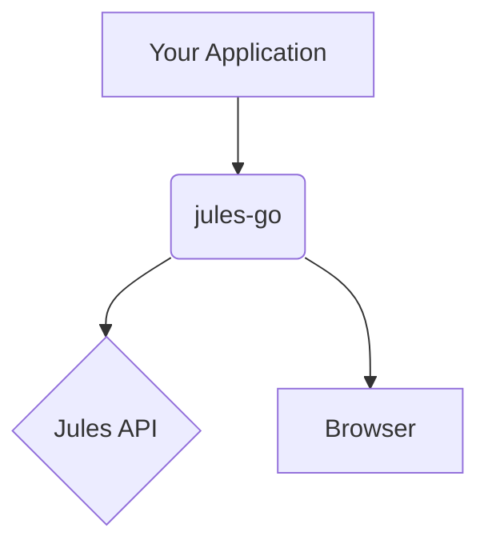

# jules-go

`jules-go` is a Go module that provides a client for the Jules API and tools for browser automation.

## Overview

This module consists of two main components:

- **API Client**: A client for interacting with the Jules API.
- **Browser Automation**: Tools for automating browser tasks.

## Installation

To install the `jules-go` module, use the following command:

```bash
go get github.com/jules/jules-go
```

## Environment Variables

The following environment variables are required:

- `JULES_API_KEY`: Your Jules API key.

## API Client Usage

To use the API client, create a new `Client` and call its methods:

```go
package main

import (
	"context"
	"fmt"
	"log"

	"github.com/jules/jules-go"
)

func main() {
	client, err := jules.NewClient()
	if err != nil {
		log.Fatal(err)
	}

	session, err := client.CreateSession(context.Background())
	if err != nil {
		log.Fatal(err)
	}

	fmt.Printf("Created session: %+v\n", session)
}
```

## Browser Automation Examples

The `jules-go` module can be used for browser automation tasks such as web scraping and testing. Here's an example of how to take a screenshot of a webpage:

```go
package main

import (
	"log"

	"github.com/jules/jules-go/browser"
)

func main() {
	// This is a placeholder for a real browser automation task.
	// The Screenshot function is not implemented in the current version.
	// NewJulesSession can be used to create a new browser session.
	session, err := browser.NewJulesSession(true)
	if err != nil {
		log.Fatal(err)
	}
	defer session.Close()

	if err := session.NavigateToSession("https://example.com"); err != nil {
		log.Fatal(err)
	}
}
```

## Architecture Diagram

The following diagram illustrates the architecture of the `jules-go` module:



## Development Setup

To set up the development environment, you'll need to have Go installed. Then, you can clone the repository and install the dependencies:

```bash
git clone https://github.com/jules/jules-go.git
cd jules-go
go mod tidy
```

To run the tests, use the following command:

```bash
go test ./...
```
