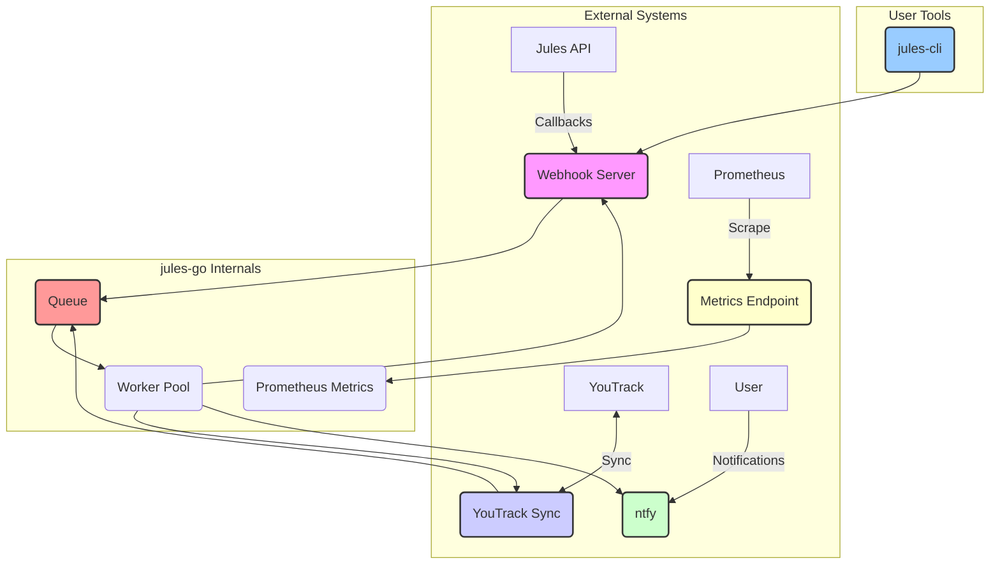

# jules-go: Automation Infrastructure

`jules-go` is the backend automation infrastructure for the Jules AI Agent. It is **not** used for creating or managing sessions directly. For session creation, plan approval, and other user-facing interactions, use `jules-mcp`.

This module provides the essential backend services that monitor, route, and handle events related to Jules sessions.

## Architecture

The following diagram illustrates the components of the `jules-go` ecosystem and their interactions.



## Components

| Component | Path | Description |
|---|---|---|
| **Webhook Server** | `cmd/jules/main.go`, `internal/webhook/` | Listens for session state callbacks from the Jules API. |
| **YouTrack Sync** | `internal/youtrack/` | Two-way synchronization between Jules sessions and YouTrack issues. |
| **ntfy Notifications**| `internal/ntfy/` | Pushes real-time notifications about session events to a ntfy topic. |
| **Prometheus Metrics**| `internal/metrics/` | Exposes internal metrics for monitoring and alerting. |
| **Queue/Worker Pool**| `internal/queue/` | Manages and processes background tasks with persistence. |
| **CLI** | `cmd/jules-cli/` | A command-line tool for listing and monitoring sessions. |

## Configuration

`jules-go` is configured entirely through environment variables.

| Variable | Required | Description |
|---|---|---|
| `JULES_API_KEY` | **Yes** | API key from [jules.google.com/settings/api](https://jules.google.com/settings/api). |
| `YOUTRACK_URL` | **Yes** | Base URL for the YouTrack instance. |
| `YOUTRACK_TOKEN`| **Yes** | Permanent token for YouTrack API access. |
| `NTFY_URL` | **Yes** | URL of the ntfy server. |
| `NTFY_TOPIC` | **Yes** | The ntfy topic to publish notifications to. |
| `VAULT_ADDR` | No | HashiCorp Vault address for fetching secrets. |
| `PORT` | No | Port for the webhook server (default: `8080`). |

## Webhook Endpoints

The webhook server exposes the following endpoints:

| Endpoint | Method | Description |
|---|---|---|
| `/webhook/session`| `POST` | Receives session state callbacks from the Jules API. |
| `/metrics` | `GET` | Exposes Prometheus metrics. |
| `/health` | `GET` | Health check endpoint. |

## When to Use What

| Task | Use |
|---|---|
| Create a new session | `jules-mcp` |
| Approve a session plan | `jules-mcp` |
| List or monitor sessions | `jules-cli` |
| Receive system callbacks | `jules-go` webhook server |
# jules-go

A Go module providing a CLI and programmatic client for the **Jules AI Agent** API, enabling efficient session management without resource-heavy browser automation.

## Why jules-go?

| Approach | Speed | Memory | Best For |
|----------|-------|--------|----------|
| `jules-cli` | ~2s per call | Minimal | Listing, monitoring, automation |
| `browser_subagent` | ~60s per call | High (opens tabs) | Approvals, PR publishing (not in API yet) |

## Quick Start

### 1. Get Your API Key

```bash
# From Vault (if configured)
export VAULT_ADDR="http://100.73.45.27:8200"
export JULES_API_KEY=$(vault kv get -field=api_key secret/jules)

# Or get from: https://jules.google.com/settings/api
```

### 2. Build the CLI

```bash
cd agents/jules-go
go build -o jules-cli-bin ./cmd/jules-cli/main.go
```

### 3. Use It

```bash
# List all sessions
./jules-cli-bin list

# Filter to active sessions only
./jules-cli-bin list 2>&1 | grep -E "IN_PROGRESS|AWAITING|PLANNING"

# Get session details (JSON)
./jules-cli-bin get 9464138654791526811

# JSON output for scripting
./jules-cli-bin list --format json | jq '.[] | select(.state != "COMPLETED")'
```

---

## CLI Commands

| Command | Description | Example |
|---------|-------------|---------|
| `list` | List all sessions with ID, STATE, TITLE | `./jules-cli-bin list` |
| `list --format json` | JSON output for scripting | `./jules-cli-bin list --format json` |
| `get <id>` | Get full session details | `./jules-cli-bin get 12345` |
| `retry <id> [--max N]` | Retry a failed session | `./jules-cli-bin retry 12345 --max 3` |
| `status` | Show system status | `./jules-cli-bin status` |
| `version` | Show version | `./jules-cli-bin version` |

### Session States

| State | Meaning | Action |
|-------|---------|--------|
| `PLANNING` | Jules is analyzing the task | Wait |
| `IN_PROGRESS` | Jules is implementing | Wait |
| `AWAITING_PLAN_APPROVAL` | Needs human approval | Use browser to approve |
| `AWAITING_USER_FEEDBACK` | Jules asked a question | Use browser to respond |
| `COMPLETED` | Work done, may have PR | Check for PR, merge if ready |
| `FAILED` | Session failed | Use `retry` or create new task |

---

## API Operations

### What CLI Can Do (Fast, No Browser)

- ✅ List all sessions
- ✅ Get session details
- ✅ Retry failed sessions
- ✅ Check system status

### What Still Needs Browser (Fallback)

- ⚠️ Create new session
- ⚠️ Approve plan
- ⚠️ Answer clarification questions
- ⚠️ Publish PR

---

## Architecture

```
┌─────────────────────────────────────────────────────────┐
│                    jules-go Module                       │
├─────────────────────────────────────────────────────────┤
│                                                          │
│  ┌──────────────┐    ┌──────────────┐                   │
│  │  jules-cli   │    │ jules-server │                   │
│  │  (CLI Tool)  │    │  (Webhook)   │                   │
│  └──────┬───────┘    └──────┬───────┘                   │
│         │                   │                            │
│         ▼                   ▼                            │
│  ┌──────────────────────────────────────┐               │
│  │           jules.Client               │               │
│  │   (API Client - client.go)           │               │
│  └──────────────────┬───────────────────┘               │
│                     │                                    │
│                     ▼                                    │
│  ┌──────────────────────────────────────┐               │
│  │    jules.googleapis.com/v1alpha      │               │
│  │    (Header: x-goog-api-key)          │               │
│  └──────────────────────────────────────┘               │
│                                                          │
└─────────────────────────────────────────────────────────┘
```

### Key Files

| File | Purpose |
|------|---------|
| `client.go` | API client with session methods |
| `cmd/jules-cli/main.go` | CLI tool entry point |
| `cmd/jules/main.go` | Webhook server entry point |
| `internal/webhook/` | Webhook handlers |
| `internal/db/` | FalkorDB integration |
| `internal/queue/` | Task queue with persistence |

---

## Programmatic Usage

```go
package main

import (
    "context"
    "log"
    "log/slog"
    "os"

    "github.com/simik394/osobni_wf/agents/jules-go"
)

func main() {
    logger := slog.New(slog.NewTextHandler(os.Stdout, nil))
    
    client, err := jules.NewClient(os.Getenv("JULES_API_KEY"), logger)
    if err != nil {
        log.Fatal(err)
    }

    // List sessions
    sessions, err := client.ListSessions(context.Background())
    if err != nil {
        log.Fatal(err)
    }

    for _, s := range sessions {
        log.Printf("Session %s: %s (%s)", s.ID, s.Title, s.State)
    }
}
```

### Available Methods

```go
// List all sessions
sessions, err := client.ListSessions(ctx)

// Get specific session
session, err := client.GetSession(ctx, "12345")

// Get session activities
activities, err := client.ListActivities(ctx, "12345")

// Approve a plan
err := client.ApprovePlan(ctx, "12345")
```

---

## Environment Variables

| Variable | Required | Description |
|----------|----------|-------------|
| `JULES_API_KEY` | Yes | API key from jules.google.com/settings/api |
| `VAULT_ADDR` | No | HashiCorp Vault address (for fetching key) |

---

## Development

```bash
# Build CLI
go build -o jules-cli-bin ./cmd/jules-cli/main.go

# Build webhook server
go build -o jules-server ./cmd/jules/main.go

# Run tests
go test ./...

# Run with verbose logging
JULES_API_KEY=xxx ./jules-cli-bin list
```

---

## Troubleshooting

### "API key not working"

The Jules API uses `x-goog-api-key` header, NOT `Authorization: Bearer`. This is handled automatically by the client.

### "Permission denied"

Ensure `JULES_API_KEY` is set and valid. Get a new key from https://jules.google.com/settings/api

### "Session not found"

Session IDs are long numeric strings (e.g., `9464138654791526811`). Copy the full ID.
