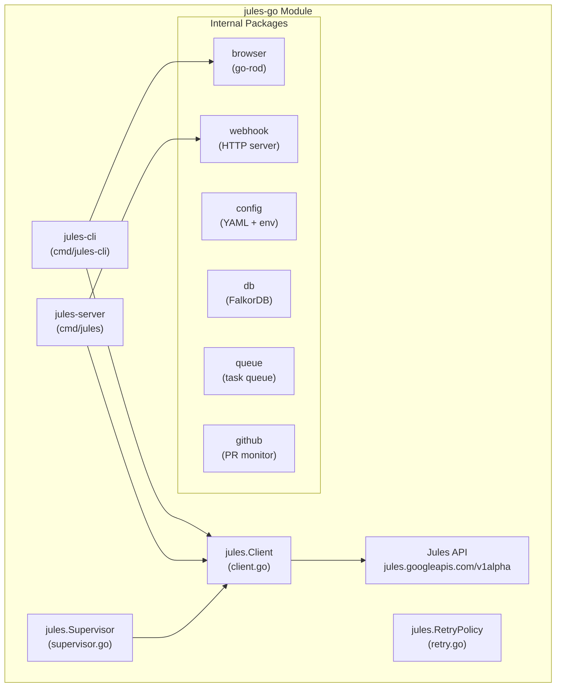

# jules-go Technical Documentation

## Overview

`jules-go` is a Go module providing a CLI and programmatic client for the **Jules AI Agent** API. It enables efficient session management without resource-heavy browser automation.

## Architecture



---

## Core Components

### 1. Client (`client.go`)

The API client for Jules operations.

| Method | Description |
|--------|-------------|
| `NewClient(apiKey, logger)` | Create authenticated client |
| `ListSessions(ctx)` | List ALL sessions (paginated) |
| `GetSession(ctx, id)` | Get single session details |
| `ListActivities(ctx, id)` | Get session activities |
| `CreateSession(ctx)` | Create new session |
| `ApprovePlan(ctx, id, plan)` | Approve a plan |

**Key Implementation: Pagination**

```go
// ListSessions fetches ALL pages using nextPageToken
func (c *Client) ListSessions(ctx context.Context) ([]*Session, error) {
    var allSessions []*Session
    pageToken := ""

    for {
        url := c.baseURL + "/sessions"
        if pageToken != "" {
            url = url + "?pageToken=" + pageToken
        }
        // ... fetch page ...
        allSessions = append(allSessions, resp.Sessions...)
        
        if resp.NextPageToken == "" {
            break  // No more pages
        }
        pageToken = resp.NextPageToken
    }
    return allSessions, nil
}
```

### 2. Supervisor (`supervisor.go`)

Implements **Watchdog Pattern** for self-healing failed sessions.

```go
type Supervisor struct {
    client       *Client
    input        chan Task        // Submit tasks here
    feedback     chan RepairRequest // Receive repair suggestions
    pollInterval time.Duration    // Default: 30s
    maxRetries   int              // Default: 3
}
```

**Capabilities:**
- Monitors submitted tasks periodically
- Detects failed/stuck sessions
- Generates repair suggestions based on error patterns
- Supports graceful shutdown

### 3. Browser (`internal/browser/browser.go`)

Uses **go-rod** for browser automation when API doesn't support an operation.

| Method | Description |
|--------|-------------|
| `NewJulesSession(headless)` | Create browser session with auth |
| `NavigateToSession(url)` | Navigate to session page |
| `ClickPublishPR()` | Publish as PR |
| `ClickPublishBranch()` | Publish as branch |
| `WaitForPublishComplete()` | Wait for publish to finish |
| `ApprovePlan()` | Click approve button |
| `IsReadyForReview()` | Check if session is ready |

### 4. Retry (`retry.go`)

Exponential backoff with jitter for resilient API calls.

```go
type RetryPolicy struct {
    MaxRetries      int           // Default: 3
    InitialDelay    time.Duration // Default: 1s
    MaxDelay        time.Duration // Default: 30s
    BackoffFactor   float64       // Default: 2.0
    NonRetriable    []string      // Errors to not retry
}
```

---

## CLI Commands

```bash
# Build
cd agents/jules-go
go build -o jules-cli-bin ./cmd/jules-cli/main.go

# Commands
./jules-cli-bin list                    # List all sessions
./jules-cli-bin list --format json      # JSON output
./jules-cli-bin list --state COMPLETED  # Filter by state
./jules-cli-bin get <session-id>        # Get session details
./jules-cli-bin retry <id> --max 3      # Retry failed session
./jules-cli-bin publish <id>            # Publish via browser
./jules-cli-bin publish-all             # Publish all waiting
./jules-cli-bin status                  # System status
./jules-cli-bin version                 # Version info
```

---

## Session States

| State | Meaning | CLI Action |
|-------|---------|------------|
| `PLANNING` | Analyzing task | Wait |
| `IN_PROGRESS` | Implementing | Wait |
| `AWAITING_PLAN_APPROVAL` | Needs approval | Browser: approve |
| `AWAITING_USER_FEEDBACK` | Ready for review | `publish` or `publish-all` |
| `COMPLETED` | Work done | Check for PR |
| `FAILED` | Session failed | `retry` |

---

## Configuration

**Environment Variables:**
| Variable | Required | Description |
|----------|----------|-------------|
| `JULES_API_KEY` | Yes | API key from jules.google.com |
| `FALKORDB_URL` | No | FalkorDB connection URL |
| `BROWSER_PATH` | No | Custom browser path |
| `LOG_LEVEL` | No | debug, info, warn, error |

**config.yaml:**
```yaml
jules_api_key: ${JULES_API_KEY}
max_concurrent_sessions: 15
webhook_port: 8090
metrics_port: 9090
log_level: info
ntfy:
  server_url: https://ntfy.sh
  topic: jules-notifications
```

---

## Verification Results

### Test Suite Results

```
✅ TestNewClient/with_API_key          PASS
✅ TestNewClient/without_API_key       PASS
✅ TestListSessions                    PASS
✅ TestListSessionsPagination          PASS  ← NEW: Verifies pagination fix
✅ TestCreateSession                   PASS
✅ TestGetSession/success              PASS
✅ TestGetSession/not_found            PASS
✅ TestDefaultRetryPolicy              PASS
✅ TestRetryPolicy_isNonRetriable      PASS
✅ TestRetryPolicy_calculateBackoff    PASS
✅ TestNewSessionDebugger              PASS
✅ TestMatchPattern (9 cases)          PASS
✅ TestGenerateHypothesis              PASS
✅ TestDebugContext                    PASS
✅ TestFailurePatternSeverities        PASS
```

### Pagination Fix Proof

The `TestListSessionsPagination` test proves the fix works:

1. **Mock server returns 2 pages:**
   - Page 1: 2 sessions + `nextPageToken: "page2token"`
   - Page 2: 1 session + `nextPageToken: ""`

2. **Assertions verified:**
   - Total sessions returned: 3 (from both pages)
   - API calls made: 2 (pagination worked)
   - Second call URL: `/sessions?pageToken=page2token`

**Before fix:** Only 1 API call, returning ~50 sessions
**After fix:** Multiple API calls, returning ALL sessions

---

## Files Modified

| File | Change |
|------|--------|
| `client.go` | Added pagination loop to `ListSessions` |
| `client_test.go` | Fixed mock to return `sessionsResponse`, added pagination test |

## Commits

```
fix(jules-go): Add pagination to ListSessions - fetches all pages instead of just first
```

---

## Usage Example

```go
package main

import (
    "context"
    "fmt"
    "log/slog"
    "os"

    jules "jules-go"
)

func main() {
    logger := slog.New(slog.NewTextHandler(os.Stdout, nil))
    client, _ := jules.NewClient(os.Getenv("JULES_API_KEY"), logger)

    // List ALL sessions (paginated automatically)
    sessions, _ := client.ListSessions(context.Background())
    
    // Count by state
    awaiting := 0
    for _, s := range sessions {
        if s.State == "AWAITING_USER_FEEDBACK" {
            awaiting++
        }
    }
    fmt.Printf("Total: %d, Awaiting Review: %d\n", len(sessions), awaiting)
}
```

---

## Future Enhancements

### Non-blocking Browser Publishing
**Issue:** [TOOLS-137](https://napoveda.youtrack.cloud/issue/TOOLS-137)

Current `publish` commands block for up to 60s. The Passive Watcher pattern (same as TOOLS-134) would allow non-blocking publishing with a working flag per tab.

### Unified Browser Pool with Multi-Profile Support
**Issue:** [TOOLS-138](https://napoveda.youtrack.cloud/issue/TOOLS-138)

Single browser instance with 3 profiles, each handling Jules/Gemini/rsrch requests via CDP. Eliminates duplicate browser processes and shares auth properly.

---

## Browser Architecture Note

**Current (Problematic):**
| Agent | Library | Profile Path |
|-------|---------|--------------|
| jules-go | go-rod | `~/.config/google-chrome` |
| rsrch | Playwright | `~/.rsrch/profiles/` |

⚠️ Separate browsers, no shared auth.

**Target (TOOLS-138):**
Single browser via CDP with 3 profiles, any agent can use any profile.
