# Key Workflows

This document defines the primary interaction flows for the project management agent.

---

## Workflow Taxonomy

Workflows are organized into hierarchical categories based on their function:

```
┌─────────────────────────────────────────────────────────────────────┐
│                         WORKFLOW HIERARCHY                          │
├─────────────────────────────────────────────────────────────────────┤
│                                                                     │
│  ┌─────────────────────────────────────────────────────────────┐   │
│  │                    LIFECYCLE FLOWS                           │   │
│  │  (Beginning to end of a project's existence)                 │   │
│  │  ├── Capture      - Birth of tasks/projects                  │   │
│  │  ├── Archive      - Graceful ending                          │   │
│  │  └── Pivot        - Rebirth / direction change               │   │
│  └─────────────────────────────────────────────────────────────┘   │
│                              ↓                                      │
│  ┌─────────────────────────────────────────────────────────────┐   │
│  │                   PLANNING FLOWS                             │   │
│  │  (Organizing and structuring work)                           │   │
│  │  ├── Triage         - Processing inbox                       │   │
│  │  ├── Breakdown      - Vague → actionable                     │   │
│  │  ├── Estimation     - Predicting effort/time                 │   │
│  │  ├── Prioritization - Determining what matters most          │   │
│  │  └── Merge/Split    - Restructuring projects                 │   │
│  └─────────────────────────────────────────────────────────────┘   │
│                              ↓                                      │
│  ┌─────────────────────────────────────────────────────────────┐   │
│  │                  EXECUTION FLOWS                             │   │
│  │  (Actually doing the work)                                   │   │
│  │  ├── Resume           - Getting back into it                 │   │
│  │  ├── Context Switch   - Moving between projects              │   │
│  │  ├── Blocking         - Handling dependencies                │   │
│  │  ├── Deadline         - Time-sensitive work                  │   │
│  │  └── Energy Matching  - Right task, right moment             │   │
│  └─────────────────────────────────────────────────────────────┘   │
│                              ↓                                      │
│  ┌─────────────────────────────────────────────────────────────┐   │
│  │                    META FLOWS                                │   │
│  │  (Thinking about the work itself)                            │   │
│  │  ├── Review           - Periodic check-ins                   │   │
│  │  ├── Retrospective    - Learning from completed work         │   │
│  │  ├── Goal Alignment   - Connecting to purpose                │   │
│  │  └── Rescue           - When things go off track             │   │
│  └─────────────────────────────────────────────────────────────┘   │
│                              ↓                                      │
│  ┌─────────────────────────────────────────────────────────────┐   │
│  │                  DISCOVERY FLOWS                             │   │
│  │  (Finding and connecting information)                        │   │
│  │  ├── Search           - Finding past work                    │   │
│  │  ├── Related          - Surfacing connections                │   │
│  │  └── Template         - Reusing patterns                     │   │
│  └─────────────────────────────────────────────────────────────┘   │
│                              ↓                                      │
│  ┌─────────────────────────────────────────────────────────────┐   │
│  │                 EXTERNAL FLOWS                               │   │
│  │  (Interactions with outside systems/people)                  │   │
│  │  ├── Integration      - Other agents & tools                 │   │
│  │  ├── Delegation       - When others are involved             │   │
│  │  └── Export/Share     - Publishing & handoff                 │   │
│  └─────────────────────────────────────────────────────────────┘   │
│                                                                     │
└─────────────────────────────────────────────────────────────────────┘
```

### Flow Relationships


---

# LIFECYCLE FLOWS

---

## 1. Capture Flow

**Trigger**: User has an idea, task, or note to record


### Input Methods
| Method | Example | Context Signals |
|--------|---------|-----------------|
| Quick text | "buy domain for portfolio site" | Keywords, active project |
| Voice note | Transcribed audio | Time, location |
| Screenshot | Annotated image | Active app, clipboard |
| Link drop | URL with optional note | Page title, metadata |

### Smart Defaults
- **Project**: Infer from keywords, recent activity, or ask
- **Priority**: Default to medium, adjust based on language ("urgent", "someday")
- **Due date**: Extract if mentioned, otherwise none
- **Tags**: Auto-suggest based on content and project

---

## 2. Resume Flow

**Trigger**: User returns to work after absence (hours, days, or weeks)


### Context Restoration Levels

**Quick Resume** (< 1 day)
- Current task with any notes
- Any pending decisions

**Standard Resume** (1-7 days)
- 2-3 sentence summary of project state
- In-progress items
- Blockers or waiting-on items
- Suggested next action

**Full Restoration** (> 7 days)
- Project goal reminder
- Timeline of recent activity
- All open threads and their status
- Related research/notes from `rsrch` agent
- Explicit "where you left off" marker

---

## 3. Review Flow

**Trigger**: Periodic check-in (daily, weekly) or explicit review request


### Daily Review Output
```
🎯 Today's Focus (3 items)
├── [Project A] Finish API design doc
├── [Project B] Reply to feedback email  
└── [Inbox] Triage 2 captured items

⚡ Quick wins available
└── [Project C] Update readme (5 min)

⏰ Time-sensitive
└── [Project A] Deadline in 2 days
```

### Weekly Review Prompts
- What got done? (celebrate)
- What's stuck? (identify blockers)
- What's next? (prioritize upcoming week)
- What can be dropped? (conscious abandonment)

---

## 4. Archive Flow

**Trigger**: Project completion OR conscious decision to stop


### Archive Metadata
- **Status**: Completed / Paused / Abandoned
- **Duration**: Start to archive date
- **Outcome summary**: What was achieved (even if partial)
- **Learnings**: Optional retrospective notes
- **Revival trigger**: For paused projects, when to resurface

### No Guilt Design
- Abandoned ≠ Failed
- Explicit closure is healthy
- Learnings are preserved
- Can always be revived

---

## 5. Integration Flow

**Trigger**: Cross-agent interaction (e.g., research informs project)


### rsrch Integration
- Research sessions can spawn projects
- Research findings link to relevant project tasks
- Project context provides research direction

### File System Integration
- Track associated repos, documents, assets
- Detect activity in project directories
- Auto-link new files to active project context

---

## 6. Triage Flow

**Trigger**: Inbox has items to process OR scheduled triage time


### Quick Triage Actions
| Key | Action | Result |
|-----|--------|--------|
| `1` | Today | Add to today's focus |
| `2` | This week | Schedule for this week |
| `3` | Someday | Low priority backlog |
| `p` | Project | Assign to/create project |
| `d` | Delete | Remove (confirm if has notes) |
| `→` | Skip | Decide later |

### Triage Cadence
- **Inbox zero goal**: Process daily, not necessarily complete
- **2-minute rule**: If doable in 2 min, do it now
- **Weekly cleanup**: Anything in inbox >7 days gets flagged

---

## 7. Breakdown Flow

**Trigger**: Vague project/task needs to become actionable


### Breakdown Prompts
When a task feels stuck, the system asks:
1. "What would 'done' look like?"
2. "What's the smallest next step?"
3. "What do you need before you can start?"
4. "Who/what are you waiting on?"

### Progressive Breakdown
- Don't force full breakdown upfront
- Reveal complexity as you work
- Allow "figure this out" as temporary task
- Auto-suggest breakdown when task ages without progress

---

## 8. Context Switching Flow

**Trigger**: Moving from one project to another


### Context Snapshot (auto-saved)
- Current task and its state
- Open files/tabs/documents
- Any draft notes or WIP
- Time spent this session
- "Breadcrumb" note: what you were thinking

### Switch Types
| Type | Behavior | Use Case |
|------|----------|----------|
| **Quick** | Minimal context save | Checking something briefly |
| **Full** | Complete handoff | Deep work switch |
| **Parallel** | Keep both active | Working on related areas |

### Interruption Handling
- "Interrupt mode": Quick capture without full switch
- Return-to-point: Bounce back after interruption
- Interruption logging: Track what broke your flow

---

## 9. Blocking Flow

**Trigger**: Task cannot proceed due to external dependency


### Waiting-On Tracking
```
🔒 Blocked Tasks (3)
├── [Portfolio] Waiting on: Domain registrar approval
│   └── Follow-up: in 2 days
├── [API Project] Waiting on: Client feedback
│   └── Last ping: 3 days ago → suggest follow-up
└── [Learning] Waiting for: Course to release
    └── Auto-check: Jan 15
```

### Blocker Types
- **Person**: Waiting on someone else
- **Resource**: Need access/tool/info
- **Time**: Has to happen on/after date
- **Predecessor**: Another task must complete first
- **Decision**: Need to make a choice (→ breakdown)

---

## 10. Pivot Flow

**Trigger**: Project scope or direction changes significantly


### Pivot Documentation
- **Why**: What triggered the change
- **What**: Old direction vs. new direction  
- **Impact**: Tasks affected
- **Learnings**: What we learned from the old approach

### Soft Pivots vs. Hard Pivots
| Soft Pivot | Hard Pivot |
|------------|------------|
| Scope adjustment | Complete restart |
| Some tasks survive | Most tasks obsolete |
| Same core goal | Goal itself changed |
| Note in timeline | Major milestone marker |

### Pivot is Not Failure
- Pivots are data, not defeat
- Preserved history shows evolution
- Makes retrospectives more valuable

---

# PLANNING FLOWS

---

## 11. Estimation Flow

**Trigger**: Need to predict effort/time for a task or project


### Estimation Levels
| Level | Precision | Use Case |
|-------|-----------|----------|
| **T-shirt** | S/M/L/XL | Quick planning |
| **Time-boxed** | 30m / 2h / 1d | Scheduling |
| **Story points** | 1/2/3/5/8/13 | Relative sizing |
| **Hours** | Specific number | Client/deadline work |

### Calibration Loop
- Track estimate vs. actual
- Show calibration trend over time
- Flag consistent over/under-estimation
- Learn from project types

### Estimation Anxiety Mitigation
- "This is a guess, not a promise"
- Ranges > point estimates
- Allow "unknown" as valid answer
- Identify unknowns that need research first

---

## 12. Merge/Split Flow

**Trigger**: Project structure needs to change


### Merge Scenarios
- Two projects were really one thing
- Consolidating related explorations
- Project became sub-project of another

### Split Scenarios
- Scope grew beyond original intent
- Different timelines emerged
- Need to share part with others

### Reference Preservation
- Old project IDs remain valid (redirect)
- Cross-references updated automatically
- Timeline history merged/preserved
- File associations updated

---

## 13. Prioritization Flow

**Trigger**: Need to determine what's most important right now

```mermaid
flowchart TD
    A[Prioritization requested] --> B{Scope?}
    B -->|Single project| C[Rank tasks within project]
    B -->|Cross-project| D[Rank across all work]
    B -->|Goals level| E[Rank projects by goal importance]
    
    C --> F[Apply priority factors]
    D --> F
    E --> F
    
    F --> G{Method?}
    G -->|Eisenhower| H[Urgent × Important matrix]
    G -->|Value/Effort| I[Impact vs. cost ratio]
    G -->|Dependencies| J[What unblocks most?]
    G -->|Gut| K[Quick intuitive sort]
    
    H & I & J & K --> L[Generate ranked list]
    L --> M[User adjusts if needed]
    M --> N[Save priority snapshot]
```



### Priority Dimensions

| Dimension | Question | Signal Weight |
|-----------|----------|---------------|
| **Urgency** | When does this need to happen? | Deadline proximity |
| **Importance** | How much does this matter? | Goal alignment |
| **Impact** | What does completion enable? | Dependency count |
| **Effort** | How much work is this? | Size estimate |
| **Energy** | What state do I need? | Task complexity |
| **Momentum** | Will this build flow? | Related to recent work |

### Eisenhower Matrix Integration

```
                    URGENT                 NOT URGENT
            ┌─────────────────────┬─────────────────────┐
            │                     │                     │
 IMPORTANT  │    DO FIRST         │    SCHEDULE         │
            │    (Crises,         │    (Deep work,      │
            │     Deadlines)      │     Planning)       │
            │                     │                     │
            ├─────────────────────┼─────────────────────┤
            │                     │                     │
 NOT        │    DELEGATE         │    ELIMINATE        │
 IMPORTANT  │    (Interruptions,  │    (Time wasters,   │
            │     Some meetings)  │     Busy work)      │
            │                     │                     │
            └─────────────────────┴─────────────────────┘
```

### Priority Signals (Auto-detected)
- ⏰ **Deadline approaching** → Urgency boost
- 🔗 **Blocks other tasks** → Impact boost
- 🎯 **High-goal alignment** → Importance boost
- 📉 **Stale task** → Attention flag
- ⚡ **Quick win** → Momentum opportunity
- 🔥 **On a streak** → Continue similar work

### Priority Decay
- Fresh priorities decay over time
- Tasks left unprioritized sink
- Periodic re-prioritization prompts
- "Aging" tasks get surfaced for decision

### Stack Ranking vs. Buckets
| Approach | When to Use |
|----------|-------------|
| **Stack rank** | When you need to pick ONE thing |
| **Priority buckets** | P0/P1/P2/P3 for batch planning |
| **Must/Should/Could** | MoSCoW for scope decisions |
| **Time buckets** | Today/This week/Someday |

### Anti-Priority Patterns
- ❌ Everything is P0 → Nothing is prioritized
- ❌ Over-optimization → Paralysis by analysis
- ❌ Never re-prioritizing → Stale priorities
- ❌ Ignoring gut feel → Missing important signals

### Priority is Contextual
- Work priority may differ from personal priority
- Energy affects what's effectively "top"
- Deadlines override everything temporarily
- Allow priority to be questioned

---

# EXECUTION FLOWS

---

## 13. Deadline Flow

**Trigger**: Task has time-sensitive completion requirement


### Deadline Types
| Type | Consequence | Flexibility |
|------|-------------|-------------|
| **Hard** | External commitment | None |
| **Soft** | Self-imposed target | Negotiable |
| **Rolling** | Recurring cadence | Reset after completion |
| **Milestone** | Part of larger timeline | Dependent on others |

### Progressive Urgency
```
📅 In 14 days    → Mentioned in weekly review
📅 In 7 days     → Daily review priority
📅 In 3 days     → Suggested focus item
📅 In 1 day      → Top of every list
📅 Overdue       → Prominent flag + "what happened?"
```

### Deadline Negotiation
- "Can this be extended?" prompt
- Track deadline changes with reasons
- Identify patterns (always late? deadline too aggressive?)

---

## 14. Energy Matching Flow

**Trigger**: User has time to work, needs to pick a task


### Energy Profiles
```
🔥 Deep Work     - Creative, complex, requires concentration
⚡ Active        - Making progress, moderate focus needed
🌙 Low Energy    - Repetitive, administrative, low stakes
⏱️ Fragmented   - Between meetings, uncertain availability
```

### Task Energy Labels
- **High**: Design decisions, writing, coding complex features
- **Medium**: Reviews, correspondence, routine implementation
- **Low**: Filing, updates, cleanup, simple fixes
- **Any**: Reading, watching tutorials, brainstorming

### Context Signals
- Time of day (morning person? night owl?)
- Calendar density (meeting-heavy day?)
- Recent completions (on a roll? burned out?)
- Environment (office? home? transit?)

---

# META FLOWS

---

## 15. Retrospective Flow

**Trigger**: Project completed OR periodic reflection


### Retrospective Prompts

**For Projects**
1. Did the outcome match the original vision?
2. What took longer than expected?
3. What would I skip if doing it again?
4. What tools/approaches worked well?
5. What would I tell past-me before starting?

**For Time Periods**
1. What am I proud of?
2. What fell through the cracks?
3. Am I working on the right things?
4. What habits helped/hurt?
5. What do I want to change?

### Learning Capture
- Tag learnings by domain (process, technical, personal)
- Link to specific moments/decisions
- Surface relevant learnings when similar work begins

---

## 16. Goal Alignment Flow

**Trigger**: Connecting daily work to larger purpose


### Goal Hierarchy
```
🎯 Life Domains
├── Career
│   ├── Current Job
│   │   └── Project: API Redesign
│   └── Skill Development
│       └── Project: Learn Rust
├── Personal
│   ├── Health
│   │   └── Project: Morning routine
│   └── Relationships
│       └── Project: Monthly friend calls
└── Creative
    └── Side Projects
        └── Project: Music production
```

### Purpose Statements
- Each project has a "why" field
- Review forces articulation of purpose
- Orphan projects get flagged for review
- Goals without active projects prompt action

### Priority Derivation
- Projects inherit priority from goal importance
- High-goal projects get preferential scheduling
- Low-goal projects candidate for archive

---

## 17. Rescue Flow

**Trigger**: Project is off track and needs intervention


### Rescue Triggers (automatic detection)
- No activity in X days (configurable)
- Deadline approaching with low progress
- Repeated status: "in progress" without movement
- User explicitly marks as struggling

### Rescue Conversation
1. "Hey, [Project] seems stuck. What's going on?"
2. Offer specific diagnoses based on data
3. Don't judge—problem-solve
4. Small first step to rebuild momentum
5. Schedule follow-up

### Rescue vs. Archive Decision
- Is the goal still important?
- Is this the right approach?
- Is now the right time?
- What's the minimum to feel progress?

---

# DISCOVERY FLOWS

---

## 18. Search Flow

**Trigger**: User needs to find past work


### Search Syntax
```
Examples:
  "portfolio"                 → Keyword in anything
  project:portfolio           → Specific project
  status:completed            → Filter by status
  @2024-01                    → By date/period
  tag:learning                → By tag
  "design" + "mobile"         → Multiple terms
  created:>30d                → Created more than 30 days ago
```

### Search Memory
- Recent searches saved
- Frequent searches pinned
- "Smart searches" based on patterns
- Search results linkable/saveable

### Cross-Archive Search
- Include archived projects (opt-in)
- Show archived results separately
- Easy to revive from search

---

## 19. Related Flow

**Trigger**: Surfacing connections between work

```mermaid
flowchart TD
    A[View item] --> B[Compute relatedness]
    B --> C{Relation types}
    C --> D[Same project siblings]
    C --> E[Same topic across projects]
    C --> F[Same time period]
    C --> G[Same skills/tools]
    C --> H[Linked explicitly]
    
    D & E & F & G & H --> I[Rank by relevance]
    I --> J[Show related panel]
    J --> K[Click to navigate]
```

### Relation Types
| Type | Example |
|------|---------|
| **Sibling** | Other tasks in same project |
| **Topic** | Similar content across projects |
| **Temporal** | Created/worked same period |
| **Skill** | Uses same tools/techniques |
| **Explicit** | Manually linked |
| **Sequential** | What came before/after |
| **Causal** | This spawned that |

### Serendipity Value
- Surface surprising connections
- "You worked on something similar in April"
- Cross-pollinate ideas between projects
- Identify recurring themes

---

## 20. Template Flow

**Trigger**: Starting something similar to past work

```mermaid
flowchart TD
    A[New project/task] --> B{Similar past work?}
    B -->|Yes| C[Suggest template]
    B -->|No| D[Start blank]
    
    C --> E{User choice}
    E -->|Use| F[Copy structure]
    E -->|Customize| G[Select parts to copy]
    E -->|Ignore| D
    
    F & G --> H[Adapt to new context]
    D --> I[Offer to create template later]
    
    H --> J[Begin work]
    I --> J
```

### Template Types
- **Project templates**: Structure + typical tasks
- **Task templates**: Checklist patterns
- **Workflow templates**: Multi-step processes
- **Review templates**: Regular retrospectives

### Template Discovery
- Auto-suggest based on project type
- Learn from repeated patterns
- Community templates (optional)
- Import/export templates

### Template Evolution
- Templates can be versioned
- Track which template spawned which project
- Refine templates based on actual usage

---

# EXTERNAL FLOWS

---

## 21. Delegation Flow

**Trigger**: Work involves someone else (even in personal projects)

```mermaid
flowchart TD
    A[Delegation needed] --> B{Delegation type?}
    B -->|Assign to person| C[Create external task]
    B -->|Outsource| D[Define deliverable]
    B -->|Ask for help| E[Frame the request]
    
    C --> F[Set expectations]
    D --> G[Specify requirements]
    E --> H[Prepare context]
    
    F & G & H --> I[Track in waiting-on]
    I --> J[Set follow-up schedule]
    J --> K[Receive & verify]
    K --> L[Integrate into project]
```

### Delegation Context
Personal projects often touch others:
- "Ask spouse about vacation dates"
- "Request access from IT"
- "Wait for client feedback"
- "Hire freelancer for design"

### Handoff Package
- What needs to be done
- Why it matters
- Deadline/urgency
- Success criteria
- Any relevant context

### Follow-up Automation
- Auto-remind to check in
- Escalate if overdue
- Log all correspondence
- Easy to re-delegate if needed

---

## 22. Export/Share Flow

**Trigger**: Need to share project info externally

```mermaid
flowchart TD
    A[Export requested] --> B{What to export?}
    B -->|Full project| C[Complete dump]
    B -->|Summary| D[Executive overview]
    B -->|Specific tasks| E[Selected items]
    B -->|Timeline| F[Visual timeline]
    
    C & D & E & F --> G{Export format?}
    G -->|Markdown| H[Plain text]
    G -->|PDF| I[Formatted document]
    G -->|JSON| J[Machine-readable]
    G -->|Share link| K[Web view]
    
    H & I & J & K --> L[Generate export]
    L --> M[Deliver/publish]
```

### Export Use Cases
- Portfolio of completed projects
- Status update for stakeholders
- Handoff to collaborator
- Backup/migration
- Integration with other tools

### Privacy Levels
- **Private**: Only you
- **Link sharing**: Anyone with link
- **Published**: Discoverable
- **Selective**: Specific sections only

---

# ADDITIONAL FLOWS

---

## 23. Recurring Flow

**Trigger**: Work that repeats on a schedule

```mermaid
flowchart TD
    A[Recurring defined] --> B[Set pattern]
    B --> C{Pattern type}
    C -->|Fixed| D[Every X days/weeks/months]
    C -->|Relative| E[X days after last completion]
    C -->|Trigger| F[When event occurs]
    
    D & E & F --> G[Generate next instance]
    G --> H[Instance appears in views]
    H --> I{Completed?}
    I -->|Yes| J[Mark done, generate next]
    I -->|Skip| K[Skip this instance]
    I -->|Pause| L[Suspend recurrence]
```

### Recurring Patterns
```
Examples:
  "Every Monday"                → Weekly fixed
  "First of month"              → Monthly fixed
  "3 days after completion"     → Relative to last done
  "When inbox > 10 items"       → Trigger-based
  "Every 2 weeks on Tuesday"    → Custom interval
```

### Flexible Recurrence
- Skip without breaking pattern
- Complete early without affecting next
- Adjust interval on the fly
- Pause/resume recurrence

### Habit vs. Task
- Habits: Success is consistency, not completion
- Tasks: Discrete items that recur
- Allow both paradigms

---

## 24. Momentum Flow

**Trigger**: Tracking and maintaining work momentum

```mermaid
flowchart TD
    A[Session starts] --> B[Log start time]
    B --> C[Work happens]
    C --> D{Check-in prompt}
    D -->|Still working| E[Continue]
    D -->|Done| F[Log completion]
    D -->|Switching| G[Context Switch Flow]
    
    E --> C
    F --> H[Calculate session stats]
    G --> H
    H --> I[Update momentum score]
    I --> J[Trend analysis]
```

### Momentum Metrics
- **Streak**: Days with project activity
- **Velocity**: Tasks completed per period
- **Focus time**: Deep work hours logged
- **Consistency**: Variance in activity

### Momentum Visualization
```
📊 This Week's Momentum

Portfolio Project  ████████░░  80% (4/5 days)
Learning Rust      ██████░░░░  60% (3/5 days)
Exercise Habit     ██████████  100% (5/5 days)

🔥 Current streak: 12 days
💪 Longest streak: 23 days
```

### Momentum Preservation
- Small wins count
- Any touch prevents streak break
- "Minimum viable progress" option
- Celebrate consistency, not just completion

---

## Interaction Principles

1. **Progressive disclosure**: Start simple, reveal depth on demand
2. **Respect attention**: Don't interrupt unless truly important
3. **Graceful degradation**: Works even with minimal input
4. **Transparent reasoning**: Explain suggestions when asked
5. **User agency**: Always allow override of automated decisions
