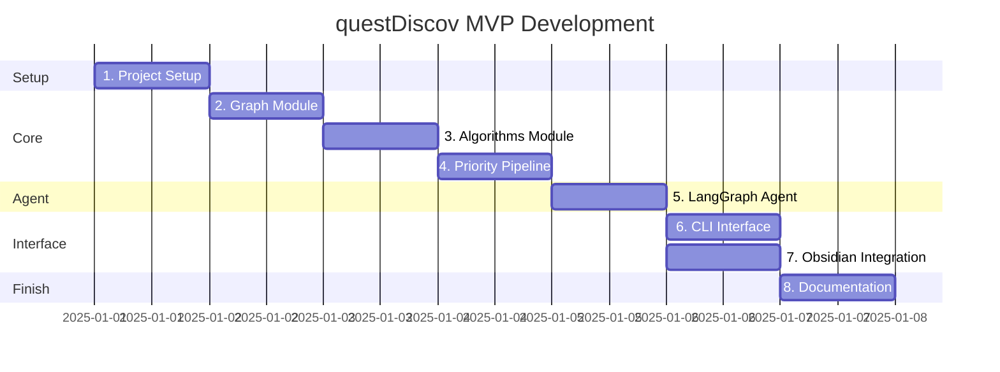

# questDiscov MVP - Work Breakdown Structure

> **Status**: Ready for Development  
> **Total Estimate**: 4 days (~32 hours)

## WBS

### 1. Project Setup (0.5 day)

- [ ] **1.1** Create project directory structure
- [ ] **1.2** Initialize `pyproject.toml` with dependencies
- [ ] **1.3** Set up `.env.example` with required variables
- [ ] **1.4** Create README.md with setup instructions
- [ ] **1.5** Verify FalkorDB connection (reuse rsrch docker-compose)

---

### 2. Graph Module (0.5 day)

- [ ] **2.1** Implement `src/graph.py`
  - [ ] 2.1.1 `QuestionGraph.__init__()` - FalkorDB connection
  - [ ] 2.1.2 `add_question()` - Create Question node
  - [ ] 2.1.3 `add_dependency()` - Create DEPENDS_ON edge
  - [ ] 2.1.4 `get_all_questions()` - Query all nodes
  - [ ] 2.1.5 `get_dependencies()` - Query all edges
  - [ ] 2.1.6 `mark_answered()` - Update answered property
  - [ ] 2.1.7 `get_unanswered()` - Filter query
- [ ] **2.2** Write `tests/test_graph.py`
- [ ] **2.3** Verify tests pass

---

### 3. Algorithms Module (0.5 day)

- [ ] **3.1** Implement `src/algorithms.py`
  - [ ] 3.1.1 `build_networkx_graph()` - Convert FalkorDB → NetworkX
  - [ ] 3.1.2 `topological_sort()` - Kahn's algorithm
  - [ ] 3.1.3 `compute_betweenness_centrality()` - NetworkX wrapper
  - [ ] 3.1.4 `get_ready_questions()` - Filter by satisfied deps
- [ ] **3.2** Write `tests/test_algorithms.py`
- [ ] **3.3** Verify tests pass

---

### 4. Priority Pipeline (0.5 day)

- [ ] **4.1** Implement `src/priority.py`
  - [ ] 4.1.1 `estimate_entropy()` - LLM-based uncertainty
  - [ ] 4.1.2 `compute_priority_score()` - Weighted sum
  - [ ] 4.1.3 `rank_questions()` - Sort by score
- [ ] **4.2** Write `tests/test_priority.py`
- [ ] **4.3** Verify tests pass

---

### 5. LangGraph Agent (1 day)

- [ ] **5.1** Implement `src/tools/graph_tools.py`
  - [ ] 5.1.1 `query_graph` tool
  - [ ] 5.1.2 `add_question` tool
  - [ ] 5.1.3 `add_dependency` tool
- [ ] **5.2** Implement `src/tools/priority_tools.py`
  - [ ] 5.2.1 `compute_priorities` tool
  - [ ] 5.2.2 `get_top_questions` tool
- [ ] **5.3** Implement `src/tools/obsidian_tools.py`
  - [ ] 5.3.1 `read_note` tool
  - [ ] 5.3.2 `write_priorities` tool
- [ ] **5.4** Implement `src/agent.py`
  - [ ] 5.4.1 `create_questDiscov_agent()` - ReAct agent
  - [ ] 5.4.2 System prompt for research strategist
- [ ] **5.5** Write `tests/test_agent.py`
- [ ] **5.6** Verify tests pass

---

### 6. CLI Interface (0.5 day)

- [ ] **6.1** Implement `src/cli.py`
  - [ ] 6.1.1 `prioritize` command
  - [ ] 6.1.2 `add` command
  - [ ] 6.1.3 `answer` command
  - [ ] 6.1.4 `chat` command
  - [ ] 6.1.5 `status` command
- [ ] **6.2** Test CLI manually
- [ ] **6.3** Update `pyproject.toml` scripts entry

---

### 7. Obsidian Integration (0.5 day)

- [ ] **7.1** Test Obsidian Local REST API connection
- [ ] **7.2** Implement priority markdown formatting
- [ ] **7.3** Implement note reading
- [ ] **7.4** End-to-end test: CLI → Obsidian file update

---

### 8. Documentation & Cleanup (0.5 day)

- [ ] **8.1** Update README.md with usage examples
- [ ] **8.2** Document environment variables
- [ ] **8.3** Add inline docstrings
- [ ] **8.4** Final commit & tag v0.1.0

---

## Dependency Order

---

## Checklist Summary

| Phase | Tasks | Hours |
|-------|-------|-------|
| 1. Setup | 5 | 4 |
| 2. Graph | 9 | 4 |
| 3. Algorithms | 6 | 4 |
| 4. Priority | 5 | 4 |
| 5. Agent | 11 | 8 |
| 6. CLI | 5 | 4 |
| 7. Obsidian | 4 | 4 |
| 8. Docs | 4 | 4 |
| **Total** | **49** | **~32** |
