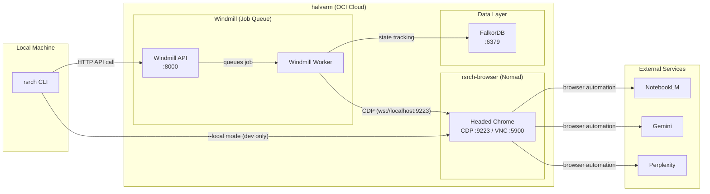

# rsrch Architecture

## Production Flow



## Modes of Operation

### Production Mode (default)
```
rsrch notebook list
rsrch notebook add-local-source --notebook "Title" file.pdf
rsrch notebook generate-audio --notebook "Title"
```

1. CLI sends HTTP request to **Windmill API** on halvarm
2. Windmill queues the job and assigns it to a worker
3. Worker connects to **rsrch-browser** via CDP (`ws://localhost:9223`)
4. Worker executes browser automation (Playwright) against target service
5. State is tracked in **FalkorDB** (PendingAudio, jobs, etc.)
6. Results are returned via Windmill job completion

### Local/Dev Mode (`--local` + `--cdp`)
```
rsrch --cdp ws://halvarm:9223 notebook list --local
```

1. CLI directly connects to rsrch-browser via CDP
2. Bypasses Windmill (no job queuing, no race condition protection)
3. Useful for debugging and development only

## Key Components

| Component | Location | Port | Purpose |
|-----------|----------|------|---------|
| `rsrch` CLI | Local machine | — | Command-line interface, sends requests |
| Windmill | halvarm (Nomad) | 8000 | Job queue, prevents race conditions |
| rsrch-browser | halvarm (Nomad) | 9223 (CDP), 5900 (VNC) | Headed Chrome for browser automation |
| FalkorDB | halvarm (Nomad) | 6379 | Graph DB for state tracking |

## Important Notes

- **No standalone rsrch HTTP server in production.** The `rsrch serve` command exists for local development only.
- **Windmill is the orchestrator.** All production requests go through Windmill to prevent race conditions when multiple jobs try to use the same browser.
- **File uploads require `--local` mode** because files are on the local machine, not on halvarm. The CLI uploads them directly via CDP to the browser.
