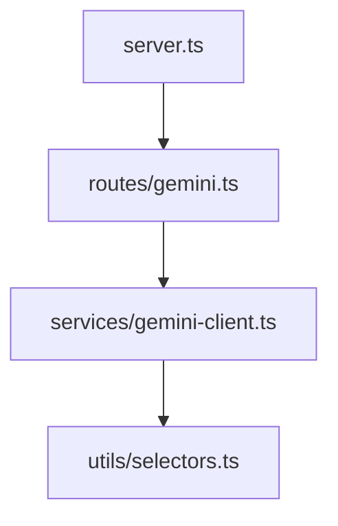

# Living Documentation Standard

> "Documentation that doesn't run is just a lie waiting to happen."

Universal standards for creating **self-updating, executable documentation** across all projects.

---

## Core Philosophy

| Principle | Description |
|-----------|-------------|
| **Single Source of Truth** | Code is truth. Reports extract from it, never duplicate. |
| **Execution = Verification** | Documentation must *run* the code it describes. |
| **Visual Abstraction** | Diagrams explain complexity, linked to source. |
| **Stable References** | Use snippet markers that survive refactoring. |

---

## Architecture

```
┌─────────────────────┐     ┌──────────────────────┐     ┌─────────────────┐
│   Source Files      │ ──► │  Generator Script    │ ──► │   report.qmd    │
│                     │     │  (TypeScript)        │     │                 │
│ // start snippet X  │     │                      │     │ {include=       │
│ function foo() {    │     │ Parses source,       │     │  snippet="X"}   │
│   ...               │     │ generates Mermaid,   │     │                 │
│ // end snippet X    │     │ outputs QMD          │     │                 │
└─────────────────────┘     └──────────────────────┘     └────────┬────────┘
                                                                  │
                                                                  │ quarto render
                                                                  ▼
                                                         ┌─────────────────┐
                                                         │  report.html    │
                                                         │ (Interactive)   │
                                                         └─────────────────┘
```

---

## The Snippet System

### Why Snippets?

Instead of copy-pasting code into documentation (which gets stale), we mark code regions and let Quarto read directly from source at render time.

### Marker Format

```typescript
// start snippet <unique-name>
export function validateInput(data: unknown): boolean {
    // implementation
}
// end snippet <unique-name>
```

### QMD Reference

```qmd
```{.typescript include="src/validation.ts" snippet="validate-input"}
```​
```

**Result:** Code is always current. Edit source → report updates automatically.

### Naming Convention

| Rule | Example |
|------|---------|
| Lowercase | `validate-user-input` |
| Hyphenated | `get-session-by-id` |
| Descriptive | `api-route-health-check` |
| Max 50 chars | — |

---

## Report Types

### 1. Test Reports

**Source:** `tests/*.test.ts`  
**Generator:** `scripts/generate_test_report.ts`  
**Output:** `TEST_REPORT.qmd`

📖 See: [TEST_REPORT_GUIDE.md](./TEST_REPORT_GUIDE.md)

Features:
- Pass/fail badges from JSON results
- Mermaid flowcharts per test
- Snippet-embedded code

---

### 2. API Reference

**Source:** `src/server.ts`, route handlers  
**Generator:** `scripts/generate_api_docs.ts` *(create if needed)*  
**Output:** `API_REFERENCE.qmd`

Extract from:
```typescript
// start snippet route-health
app.get('/health', (req, res) => {
    res.json({ status: 'ok' });
});
// end snippet route-health
```

Report shows:
| Method | Path | Description |
|--------|------|-------------|
| GET | `/health` | Health check endpoint |

With live `curl` example that executes during render.

---

### 3. CLI Reference

**Source:** `src/cli.ts`, commander definitions  
**Generator:** `scripts/generate_cli_docs.ts` *(create if needed)*  
**Output:** `CLI_REFERENCE.qmd`

Extract from:
```typescript
// start snippet cmd-gemini-chat
program
  .command('gemini chat <prompt>')
  .description('Send a chat message to Gemini')
  .action(geminiChat);
// end snippet cmd-gemini-chat
```

Report shows each command with:
- Description
- Usage example
- Options table

---

### 4. Architecture Diagrams

**Source:** All `src/**/*.ts` imports  
**Generator:** `scripts/generate_architecture.ts` *(create if needed)*  
**Output:** `ARCHITECTURE.qmd`

Generates Mermaid from import analysis:


---

### 5. Configuration Reference

**Source:** `.env.example`, config schemas  
**Generator:** `scripts/generate_config_docs.ts` *(create if needed)*  
**Output:** `CONFIG_REFERENCE.qmd`

Documents all environment variables with:
- Name
- Required/Optional
- Default value
- Description

---

## Toolkit

| Tool | Purpose | Install |
|------|---------|---------|
| [Quarto](https://quarto.org/) | Render QMD → HTML | `brew install quarto` |
| `include-code-files` | Snippet embedding | `quarto add quarto-ext/include-code-files` |
| [Mermaid](https://mermaid.js.org/) | Diagrams | Built into Quarto |
| ts-node | Run generators | `npm i -g ts-node` |

---

## Setting Up in a New Project

### 1. Install Quarto Extension

```bash
cd your-project
quarto add quarto-ext/include-code-files --no-prompt
```

### 2. Patch for TypeScript Support

Edit `_extensions/quarto-ext/include-code-files/include-code-files.lua`:

```lua
-- Line ~29: Add .ts support
elseif string.match(cb.attributes.include, ".o?js$") 
    or string.match(cb.attributes.include, ".css$") 
    or string.match(cb.attributes.include, ".ts$") then  -- ADD THIS
  comment = "//"

-- Line ~42: Escape hyphens in snippet names
local escaped_snippet = cb.attributes.snippet:gsub("([%^%$%(%)%%%.%[%]%*%+%-%?])", "%%%1")  -- ADD THIS
local p_start = string.format("^ *%s start snippet %s%s", comment, escaped_snippet, comment_stop)
local p_stop = string.format("^ *%s end snippet %s%s", comment, escaped_snippet, comment_stop)
```

### 3. Create Generator Template

```typescript
// scripts/generate_<aspect>_report.ts
import fs from 'fs';
import path from 'path';

const SRC_DIR = path.join(__dirname, '../src');

function main() {
    console.log('---');
    console.log('title: "My Report"');
    console.log('format:');
    console.log('  html:');
    console.log('    toc: true');
    console.log('filters:');
    console.log('  - include-code-files');
    console.log('---');
    
    // Parse source files
    // Generate Mermaid diagrams
    // Output snippet references
}

main();
```

### 4. Add Snippet Markers

For existing code, create `scripts/add_snippets.ts` that scans and adds markers.

---

## Workflow Summary

```bash
# 1. Add snippet markers to source (one-time or after new code)
npx ts-node scripts/add_snippets.ts

# 2. Generate QMD from source
npx ts-node scripts/generate_<aspect>_report.ts > ASPECT_REPORT.qmd

# 3. Render to HTML
quarto render ASPECT_REPORT.qmd

# 4. Open in browser
open ASPECT_REPORT.html
```

---

## Directory Structure

```
project/
├── _extensions/
│   └── quarto-ext/include-code-files/   # Quarto extension
├── docs/
│   ├── LIVING_DOCUMENTATION.md          # This file
│   ├── TEST_REPORT_GUIDE.md             # Test-specific details
│   └── *.qmd / *.html                   # Generated reports
├── scripts/
│   ├── generate_test_report.ts          # Test report generator
│   ├── generate_api_docs.ts             # API docs generator
│   ├── add_snippets.ts                  # Snippet marker tool
│   └── ...
├── src/
│   └── (with snippet markers)
└── tests/
    └── (with snippet markers)
```

---

## Best Practices

1. **Commit QMD, not HTML** — HTML is a build artifact
2. **Run generators in CI** — Catch drift early
3. **Use consistent naming** — Same snippet names across reports
4. **Keep snippets small** — One function/route/test per snippet
5. **Document the generators** — They are code too!
