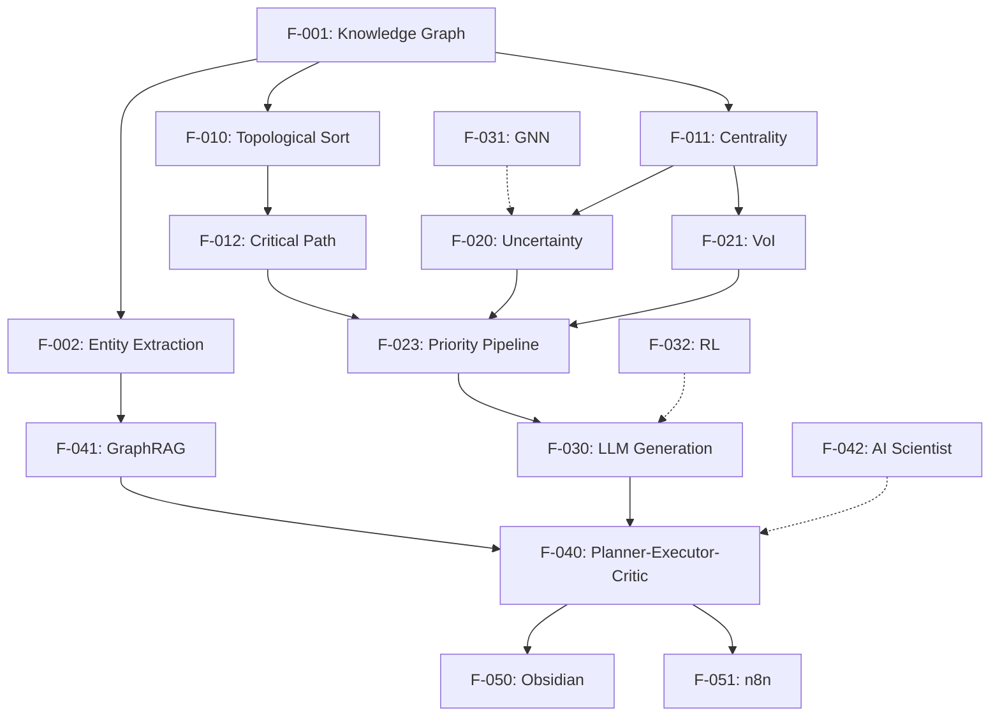

# Research Question Generation System - Feature Index

> **Source**: [Strategie Generování Výzkumných Otázek](file:///home/sim/Obsi/Prods/01-pwf/flows/questDiscov/Strategie%20Generov%C3%A1n%C3%AD%20V%C3%BDzkumn%C3%BDch%20Ot%C3%A1zek_%20Od%20Algoritm%C5%AF%20po%20Neuro-symbolickou%20AI.txt)  
> **Created**: 2025-12-19  
> **Status**: Draft Proposals

## Overview

This directory contains feature proposals extracted from the vision document for an automated research question generation system. The system aims to optimize the process of solving "epic problems" through intelligent question prioritization and knowledge graph-based analysis.

## Core Objective

Transform chaotic, high-entropy research problems into structured, navigable knowledge spaces by:
1. Representing knowledge as a graph (DAG) of dependencies
2. Applying mathematical optimization to select highest-value questions
3. Combining neural (LLM/GNN) and symbolic (graph algorithms) approaches
4. Automating the feedback loop between exploration and execution

---

## Feature Categories

### 🏗️ Infrastructure (Foundation)

| ID | Feature | Priority | Status | Spec |
|----|---------|----------|--------|------|
| F-001 | [Knowledge Graph Foundation](./F-001_knowledge_graph_foundation.md) | High | Draft | Graph-based storage for entities, hypotheses, relationships |
| F-002 | [Entity & Relationship Extraction](./F-002_entity_relationship_extraction.md) | High | Draft | LLM-powered extraction from documents |

---

### 📊 Graph Analysis (Structural Intelligence)

| ID | Feature | Priority | Status | Spec |
|----|---------|----------|--------|------|
| F-010 | [Topological Sorting & DAG Analysis](./F-010_topological_sorting.md) | High | Draft | Kahn's algorithm, dependency sequencing |
| F-011 | [Centrality Metrics](./F-011_centrality_metrics.md) | High | Draft | Betweenness, information centrality for node importance |
| F-012 | [Critical Path Analysis](./F-012_critical_path_analysis.md) | Medium | Draft | CPM/PERT for probabilistic scheduling |

---

### 🎯 Prioritization (Decision Intelligence)

| ID | Feature | Priority | Status | Spec |
|----|---------|----------|--------|------|
| F-020 | [Entropy/Uncertainty Sampling](./F-020_uncertainty_sampling.md) | High | Draft | Active learning via maximum entropy selection |
| F-021 | [Value of Information Calculation](./F-021_value_of_information.md) | High | Draft | Bayesian VoI for question prioritization |
| F-022 | [Monte Carlo Simulation](./F-022_monte_carlo_simulation.md) | Medium | Draft | Criticality indices, risk assessment |
| F-023 | [Question Priority Pipeline](./F-023_question_priority_pipeline.md) | High | Draft | Composite scoring: entropy × centrality × criticality |

---

### 🤖 AI/ML (Neural Intelligence)

| ID | Feature | Priority | Status | Spec |
|----|---------|----------|--------|------|
| F-030 | [LLM Hypothesis Generation](./F-030_llm_hypothesis_generation.md) | High | Draft | Chain-of-Thought, problem decomposition |
| F-031 | [GNN Link Prediction](./F-031_gnn_link_prediction.md) | Medium | Draft | GraphSAGE/GAT for relationship discovery |
| F-032 | [RL Graph Navigation](./F-032_rl_graph_navigation.md) | Low | Draft | Multi-hop reasoning with HRL |

---

### 🧠 Neuro-Symbolic Architecture (Integration)

| ID | Feature | Priority | Status | Spec |
|----|---------|----------|--------|------|
| F-040 | [Planner-Executor-Critic Framework](./F-040_planner_executor_critic.md) | High | Draft | Agent architecture with symbolic constraints |
| F-041 | [GraphRAG Contextualization](./F-041_graphrag.md) | High | Draft | Community detection, hierarchical summarization |
| F-042 | [AI Scientist Loop](./F-042_ai_scientist_loop.md) | Low | Draft | Automated idea generation & peer review |

---

### 🔗 Integrations (Ecosystem)

| ID | Feature | Priority | Status | Spec |
|----|---------|----------|--------|------|
| F-050 | [Obsidian PKM Integration](./F-050_obsidian_integration.md) | High | Draft | Local REST API, Dataview, Smart Connections |
| F-051 | [n8n Workflow Orchestration](./F-051_n8n_orchestration.md) | Medium | Draft | LangChain nodes, automated pipelines |

---

## Priority Legend

| Priority | Meaning | Criteria |
|----------|---------|----------|
| **High** | Essential | Core value proposition, blocks other features |
| **Medium** | Important | Significant enhancement, can be parallel development |
| **Low** | Nice-to-have | Advanced capability, future phase |

## Implementation Order

## Cost-Benefit Summary

| Approach | Setup Cost | Runtime Cost | Best For |
|----------|------------|--------------|----------|
| Pure Algorithmic (Graph) | High (ontology design) | Low (CPU) | Structured domains |
| Pure LLM (API) | Low (prompt engineering) | High (token costs) | Exploration, generation |
| Hybrid Neuro-Symbolic | Highest | Optimized | Epic problems, production |

---

## Next Steps

1. Review and prioritize feature proposals
2. Identify dependencies between features
3. Create implementation roadmap
4. Begin with F-001 (Knowledge Graph Foundation)
