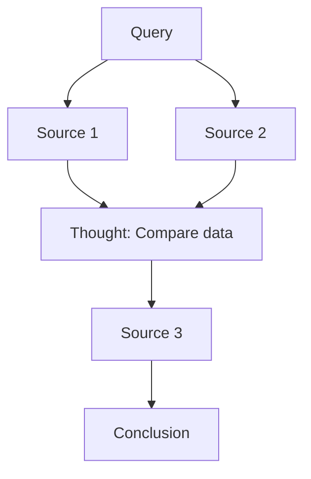

# Gemini Research Parser Specification

> **Status**: Draft  
> **Date**: 2025-12-11

---

## 1. Overview

Replace Gemini's built-in "Export to Google Docs" with a custom parser that extracts rich research data including content, sources (used and unused), agent reasoning steps, and a structured research flow diagram.

---

## 2. Problem Statement

- Gemini's export button is **fragile** (selector changes break automation)
- The built-in export only provides the final content, **not**:
  - Which sources were consulted
  - Which sources were skipped
  - The agent's reasoning/thinking steps
  - The order of source consultation

---

## 3. Goals

1. **Parse research content** directly from the DOM
2. **Extract citations** with links to original sources
3. **Capture agent thinking** (research phases, decisions)
4. **Build research flow** showing source → thought → source chain
5. **Output rich document** (Markdown or Google Doc) with full provenance

---

## 4. DOM Structure (Discovered)

### 4.1 Research Content Panel
```
div.container (within immersives-open context)
├── headings (h1, h2, h3)
├── paragraphs
├── lists
└── citation buttons [aria-label='Další informace']
```

### 4.2 Chat History (Left Panel)
```
infinite-scroller.chat-history
├── User prompts
├── "Zahájit výzkum" (Start research)
├── "Dokončil jsem..." (Completed research)
└── Research chip with status
```

### 4.3 Citation Buttons
Small buttons within text with `aria-label='Další informace'` (More info).
Clicking these may reveal source details.

---

## 5. Output Format

### 5.1 Parsed Research Document

```markdown
# [Research Title]

> Query: [Original query]
> Generated: [Timestamp]
> Session: [Registry ID if available]

## Summary
[Extracted summary or first paragraph]

## Main Content
[Full research content with inline citations]

---

## Sources Used

| # | Title | URL | Cited In |
|---|-------|-----|----------|
| 1 | Source Title | https://... | Section 1.2, 2.1 |
| 2 | Another Source | https://... | Section 3.4 |

## Sources Consulted (Not Used)

| # | Title | URL | Reason |
|---|-------|-----|--------|
| 1 | Irrelevant Source | https://... | Off-topic |

## Agent Reasoning

### Research Phase 1: Initial Search
- Searched for: "key terms"
- Found 15 sources

### Research Phase 2: Deep Analysis
- Selected top 5 sources
- Cross-referenced data

---

## Research Flow


```

---

## 6. Technical Design

### 6.1 Parser Functions

```typescript
interface ParsedResearch {
    title: string;
    query: string;
    content: string;
    contentHtml: string;
    citations: Citation[];
    unusedSources: Source[];
    reasoningSteps: ReasoningStep[];
    researchFlow: FlowNode[];
    createdAt: string;
}

interface Citation {
    id: number;
    text: string;
    url: string;
    usedInSections: string[];
}

interface ReasoningStep {
    phase: string;
    action: string;
    timestamp?: string;
}

interface FlowNode {
    type: 'query' | 'source' | 'thought' | 'conclusion';
    label: string;
    links: string[];
}
```

### 6.2 Core Functions

| Function | Purpose |
|----------|---------|
| `parseResearchContent(page)` | Extract main content from `div.container` |
| `extractCitations(page)` | Click citation buttons, extract URLs |
| `extractReasoningSteps(page)` | Parse chat history for research phases |
| `buildResearchFlow(citations, steps)` | Construct Mermaid diagram |
| `exportToMarkdown(parsed)` | Generate Markdown document |
| `createGoogleDoc(parsed)` | Create Google Doc via API |

---

## 7. Integration

### 7.1 Replace `exportToGoogleDocs`

Current:
```typescript
await geminiClient.exportToGoogleDocs();
```

New:
```typescript
const parsed = await geminiClient.parseResearch();
const markdown = exportToMarkdown(parsed);
const docId = await createGoogleDoc(markdown);
```

### 7.2 Registry Integration

```typescript
// After parsing
const sessionId = registry.registerSession(geminiSessionId, parsed.query);
const docId = registry.registerDocument(sessionId, googleDocId, parsed.title);
```

---

## 8. CLI Commands

```bash
# Parse current session to markdown
rsrch gemini parse --output research.md

# Parse and create Google Doc
rsrch gemini parse --to-docs

# Parse with full provenance
rsrch gemini parse --full --output research.md
```

---

## 9. WBS

### Phase 1: Content Parser
- [ ] Create `parseResearchContent()` in `gemini-client.ts`
- [ ] Extract headings, paragraphs, lists from `div.container`
- [ ] Preserve HTML structure for formatting

### Phase 2: Citation Extractor
- [ ] Create `extractCitations()` 
- [ ] Find citation buttons by `aria-label`
- [ ] Click to reveal source details
- [ ] Map citations to sections

### Phase 3: Reasoning Extractor
- [ ] Create `extractReasoningSteps()`
- [ ] Parse chat history for research phases
- [ ] Extract "Zahájit výzkum" / "Dokončeno" markers

### Phase 4: Research Flow Builder
- [ ] Create `buildResearchFlow()`
- [ ] Analyze citation order
- [ ] Generate Mermaid diagram

### Phase 5: Export Functions
- [ ] Create `exportToMarkdown()`
- [ ] Create `createGoogleDoc()` (via Google Docs API or Drive)
- [ ] Integrate with registry

### Phase 6: Testing
- [ ] Test on existing research session
- [ ] Verify all citations extracted
- [ ] Verify Mermaid diagram renders
