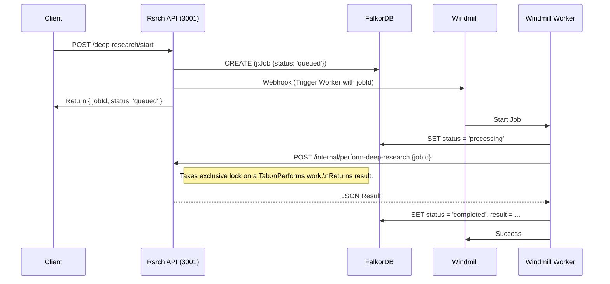

# Async Architecture: Windmill & FalkorDB Integration (TOOLS-132)

## Problem
The current `rsrch` agent handles asynchronous tasks (Deep Research, Audio Generation) using:
1.  In-memory promises (detached from HTTP request).
2.  Ad-hoc FalkorDB status updates.
3.  Unsafe page reuse in `GeminiClient` (Risk of race conditions).

This approach is fragile (lost on restart) and lacks concurrency control (multiple async jobs might clobber the same browser tab).

## Solution
Offload job orchestration to **Windmill** and state persistence to **FalkorDB**, treating `rsrch` as a "Browser Capability Service".

### Key Components

1.  **FalkorDB (State of Truth)**
    - Nodes: `Job` (id, type, status, params, result).
    - Status: `queued` -> `processing` -> `completed` | `failed`.
    - Relationships: `(:Job)-[:BELONGS_TO]->(:Session)`.

2.  **Windmill (Orchestrator)**
    - Role: Manage queue, retries, and concurrency limits.
    - Scripts: `rsrch/dispatcher` (Generic), `rsrch/worker` (Task specific).

3.  **Rsrch Server (Capability Provider)**
    - Role: Execute browser actions *synchronously* when commanded by a Worker.
    - Endpoints:
        - `POST /internal/perform-deep-research` (Blocking, exclusive lock on a tab).
        - `POST /jobs/queue` (Public, creates Job + Triggers Windmill).

### Data Flow

### Implementation Steps

1.  **Refactor `server.ts`**:
    - Move logic from `(async () => { ... })` into dedicated "Internal" endpoints (e.g., `_executeDeepResearch`).
    - Ensure these internal endpoints allocate a *Fresh* or *Locked* tab.

2.  **Create Windmill Script (`rsrch/worker`)**:
    - Input: `jobId`, `jobType`.
    - Logic:
        - Fetch Job params mainly for validation.
        - Call `RsrchAPI` internal endpoint (long timeout).
        - Handle failures (update DB to failed).

3.  **Concurrency Control**:
    - Define `MAX_CONCURRENT_JOBS` in Windmill (e.g., 2 workers).
    - This implicitly limits browser tab usage without complex semaphore logic in Node.js.

4.  **Migration**:
    - Update `agents/rsrch/src/server.ts` to use `WindmillClient.executeJob` instead of in-memory promises.

## Benefits
- **Persistence**: Jobs survive server restarts (Windmill retry).
- **Scalability**: Can scale workers independently of the API server (if using remote browsers).
- **Safety**: Windmill prevents overloading the browser by limiting concurrent worker execution.
