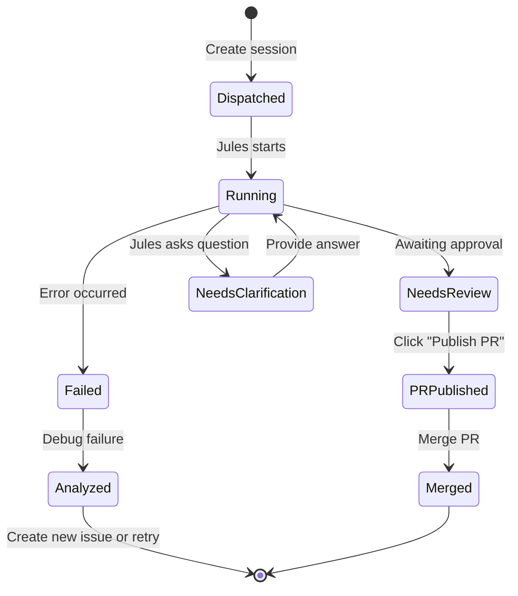
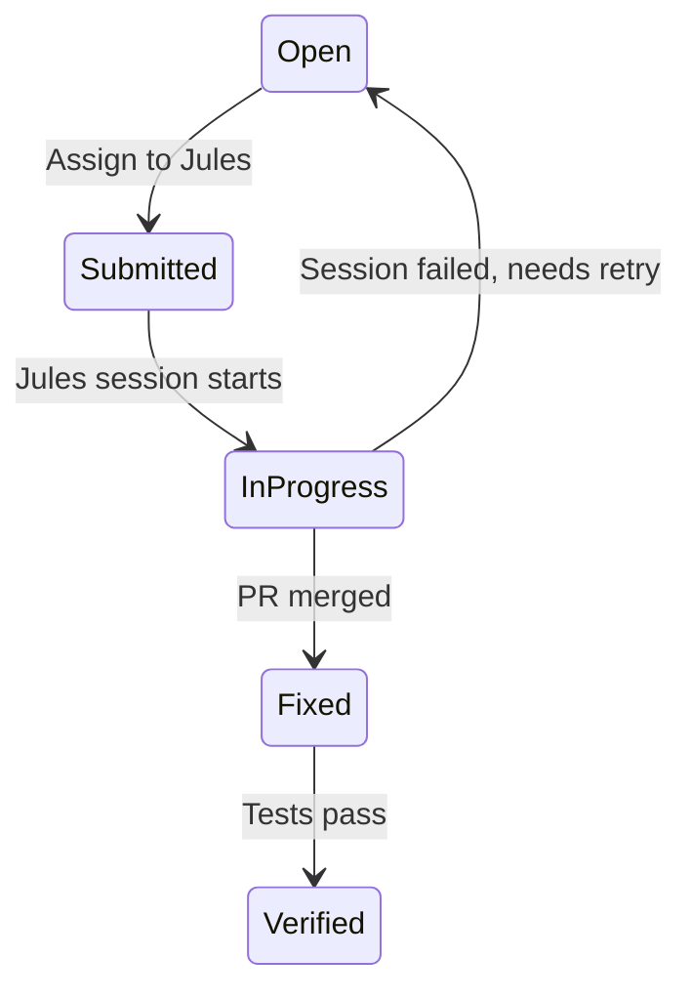

# Autonomous Project Manager Framework

> **Purpose**: Unified workflow framework for operating as an autonomous PM across the `jules-go`, `rsrch`, `angrav`, and infrastructure projects.

---

## 1. Core Operating Principles

### 1.1 Production-Grade Tooling Only

> [!CAUTION]
> **NEVER take shortcuts when production-grade tools exist.**

| ❌ Forbidden Pattern | ✅ Required Pattern |
|---------------------|---------------------|
| `nohup` / `screen` / `tmux` | Windmill job orchestration |
| `docker cp` hacks | Proper deployment pipelines |
| `curl` with hardcoded auth | Configured APIs with proper auth |
| `/tmp/` scripts | Documented, versioned tools |
| Ad-hoc shell scripts | Reusable, tested scripts in repo |

**Rule**: If a tool isn't configured, **set it up properly first**. Don't bypass with shortcuts.

### 1.2 State Synchronization

Every operation that changes external state MUST update the corresponding tracking system:

| Operation | State System | Update Action |
|-----------|--------------|---------------|
| Start Jules session | YouTrack | Set issue to `In Progress` |
| Jules session completes | YouTrack | Set issue to `Fixed`, add PR link |
| Jules session fails | YouTrack | Add comment with failure analysis |
| Code merged | Git | Push to `main`, tag if release |
| Browser action | FalkorDB | Update node state immediately |

### 1.3 Non-Blocking Architecture

> [!IMPORTANT]
> NEVER block waiting for long-running operations. Return immediately and use watchers/webhooks.

```
┌─────────────┐     ┌─────────────┐     ┌─────────────┐
│   Trigger   │────▶│   Action    │────▶│   Return    │
│  (Windmill) │     │ (Update DB) │     │ Immediately │
└─────────────┘     └─────────────┘     └─────────────┘
                           │
                           ▼
                    ┌─────────────┐
                    │   Watcher   │
                    │ (Background)│
                    └──────┬──────┘
                           │
                           ▼
                    ┌─────────────┐
                    │   Webhook   │
                    │ (On Complete)│
                    └─────────────┘
```

---

## 2. Jules Agent Management Loop

### 2.1 Session Lifecycle



### 2.2 Primary Tools: jules-cli & jules-mcp

> [!TIP]
> **Tool Precedence:**
> 1. `jules-cli` (Fastest, read-only/status)
> 2. `jules-mcp` (Programmatic, reliable execution)
> 3. `browser_subagent` (Last resort only)

**Setup:**
```bash
# Load API key from Vault
export VAULT_ADDR="http://100.73.45.27:8200"
export JULES_API_KEY=$(vault kv get -field=api_key secret/jules)

# Or add to shell profile for persistence
echo 'export JULES_API_KEY="<key>"' >> ~/.bashrc
```

**Available Commands:**

| Command | Purpose | Example |
|---------|---------|--------|
| `list` | List all sessions with ID, STATE, TITLE | `./jules-cli-bin list` |
| `list --format json` | JSON output for scripting | `./jules-cli-bin list --format json \| jq '.[]'` |
| `get <id>` | Get session details | `./jules-cli-bin get 11119854993266554089` |
| `retry <id>` | Retry failed session | `./jules-cli-bin retry 12345 --max 3` |
| `status` | Show system status | `./jules-cli-bin status` |

**Quick Status Check:**
```bash
cd /home/sim/Obsi/Prods/01-pwf/agents/jules-go
./jules-cli-bin list 2>&1 | grep -E "IN_PROGRESS|AWAITING|PLANNING"
```

### 2.3 Fallback: Browser Automation

> [!WARNING]
> **Only use `browser_subagent` when CLI AND MCP cannot perform the operation.**

| Operation | Tool | Notes |
|-----------|------|-------|
| List sessions | `jules-cli list` | ✅ Primary |
| Get session status | `jules-cli get` | ✅ Primary |
| Retry failed | `jules-cli retry` | ✅ Primary |
| **Approve plan** | `jules-mcp` | ✅ Primary |
| **Answer clarification** | `jules-mcp` | ✅ Primary |
| **Create new session** | `jules-mcp` | ✅ Primary |
| **Publish PR** | `browser_subagent` | ⚠️ Not in CLI/MCP yet |

### 2.4 Dispatch Decision Matrix

| Condition | Action |
|-----------|--------|
| Daily limit < 80% used | Dispatch new tasks freely |
| Daily limit 80-95% used | Prioritize critical/blocking tasks only |
| Daily limit > 95% used | Stop dispatching, focus on reviews |
| Session awaiting review | Approve/reject before dispatching new |
| Session needs clarification | Respond immediately |

### 2.5 Monitoring Cadence

| Check Type | Frequency | Tool |
|------------|-----------|------|
| Session status | Every 5-10 minutes | `jules-cli list` |
| Parse PR status | On session complete | GitHub MCP / `gh pr list` |
| Test status | Before merging | `run_command` with test suite |

### 2.6 Session Approval Workflow (Browser Fallback)

```
1. Check for sessions needing action: jules-cli list | grep AWAITING
2. For AWAITING_USER_FEEDBACK or AWAITING_PLAN_APPROVAL:
   a. Use browser_subagent to navigate to session URL
   b. Review the plan or clarification
   c. Click "Approve Plan" or type response
3. For COMPLETED with no PR:
   a. Navigate to session
   b. Click "Publish PR"
   c. Wait for PR creation
4. Update YouTrack: State → Fixed, add PR link comment
```

---

## 3. YouTrack Integration

### 3.1 Issue State Machine



### 3.2 Jules → YouTrack State Mapping

| Jules State | YouTrack State | YouTrack Action |
|-------------|----------------|-----------------|
| Session created | `Submitted` | Add session link comment |
| `PLANNING` / `IN_PROGRESS` | `In Progress` | - |
| `AWAITING_PLAN_APPROVAL` | `In Progress` | Add comment: "Waiting for plan approval", tag: `blocked-on-human` |
| `AWAITING_USER_FEEDBACK` | `In Progress` | Add comment: "Jules asking: [question]", tag: `blocked-on-human` |
| `COMPLETED` (no PR yet) | `In Progress` | Add comment: "Completed, awaiting PR publish" |
| PR published | `In Progress` | Add PR link comment |
| PR merged | `Fixed` | - |
| Session failed | `Open` | Add failure analysis comment, remove `jules-assigned` |
| Tests pass | `Verified` | - |

> [!TIP]
> Use `blocked-on-human` tag to easily find all issues waiting for human action:
> ```
> tag: blocked-on-human State: {In Progress}
> ```

### 3.3 Tagging Convention

| Tag | Meaning |
|-----|---------|
| `jules-discovered` | Issue discovered by Jules during execution |
| `jules-assigned` | Issue delegated to Jules |
| `blocked-on-human` | Requires human decision |
| `tech-debt` | Technical debt for cleanup |

---

## 4. Code Integration Pipeline

### 4.1 Merge Criteria

Before merging any PR:

- [ ] All CI checks pass (if configured)
- [ ] Related tests pass locally
- [ ] No merge conflicts with `main`
- [ ] YouTrack issue state updated
- [ ] LESSONS_LEARNED.md updated if significant insight gained

### 4.2 Post-Merge Actions

```bash
# 1. Fetch latest from merged PR branch
git fetch origin

# 2. Merge to main
git checkout main
git pull origin main

# 3. Run tests
cd agents/<project> && npm test  # or go test ./...

# 4. Push if clean
git push origin main

# 5. Update YouTrack
# Issue → Fixed state, add commit SHA
```

### 4.3 Conflict Resolution

| Conflict Type | Resolution |
|---------------|------------|
| Simple (whitespace, imports) | `git checkout --theirs` or `--ours` as appropriate |
| Substantive (logic changes) | Review both versions, merge manually |
| Breaking (architectural) | Flag for human review |

---

## 5. Proactive Task Discovery

### 5.1 Sources of New Tasks

| Source | Action |
|--------|--------|
| Failed tests | Create YouTrack issue, assign to Jules |
| Lint errors | Create YouTrack issue if non-trivial |
| TODO/FIXME comments | Create YouTrack issue with context |
| Jules session failures | Analyze and create follow-up issue |
| Outdated dependencies | Create upgrade task |

### 5.2 Task Prioritization

```
Priority Score = (Urgency × 3) + (Impact × 2) + (Dependencies × 1)

Urgency:
  - Blocking other work: 10
  - Due within 7 days: 7
  - Requested by user: 5
  - Nice to have: 2

Impact:
  - Security/data issue: 10
  - Breaks production: 9
  - Feature implementation: 5
  - Technical debt: 3
  - Documentation: 1

Dependencies:
  - Blocks 3+ other tasks: 10
  - Blocks 1-2 tasks: 5
  - No dependencies: 1
```

---

## 6. Agent Coordination

### 6.1 Available Agents

| Agent | Purpose | Invocation |
|-------|---------|------------|
| `jules` | Code implementation, tests, refactoring | Browser → jules.google.com |
| `rsrch` | Research queries, NotebookLM, Gemini | `node dist/index.js gemini ask "..."` |
| `browser_subagent` | UI automation, verification | `browser_subagent` tool |

### 6.2 Parallel Execution Rules

```
✅ Allowed in parallel:
- Multiple rsrch queries (different topics)
- Checking Jules status + running tests
- YouTrack updates + git operations

❌ Never in parallel:
- Multiple Jules sessions on same issue
- Browser actions on same page
- Conflicting git operations
```

### 6.3 Delegation Decision Matrix

> [!IMPORTANT]
> **Core Rule**: Compare task complexity against issue management overhead.
> If executing the task is easier than creating/managing/closing a YouTrack issue → do it yourself.

#### When to Delegate to Jules

| Condition | Action |
|-----------|--------|
| Task requires **significant code changes** (3+ files, 50+ lines) | ✅ Delegate to Jules |
| Task involves **writing tests** from scratch | ✅ Delegate to Jules |
| Task is **refactoring** with clear scope | ✅ Delegate to Jules |
| Task requires **understanding unfamiliar codebase areas** | ✅ Delegate to Jules |
| Task can run **in parallel** while you do other work | ✅ Delegate to Jules |
| Daily limit has capacity | ✅ Delegate to Jules |

#### When to Do It Yourself

| Condition | Action |
|-----------|--------|
| **Quick fix** (typo, single-line change, config tweak) | ⚡ Do it yourself |
| Task **blocks other work** and needs immediate resolution | ⚡ Do it yourself |
| Change is **faster to make than to describe** to Jules | ⚡ Do it yourself |
| You're **already looking at the code** | ⚡ Do it yourself |
| Jules daily limit is **>95% used** | ⚡ Do it yourself |
| Task requires **browser/UI interaction** Jules can't do | ⚡ Do it yourself (with browser_subagent) |

#### Complexity Threshold Guide

```
Complexity Score = (Files touched × 2) + (Lines changed ÷ 10) + (Time estimate in minutes ÷ 5)

Score < 5   → Do it yourself (not worth Jules overhead)
Score 5-15  → Judgment call (consider current workload)
Score > 15  → Delegate to Jules
```

**Examples:**
- Fix typo in README: 1 file × 2 + 1 line ÷ 10 + 2 min ÷ 5 = **2.5** → Do yourself
- Add new API endpoint: 3 files × 2 + 80 lines ÷ 10 + 30 min ÷ 5 = **20** → Jules
- Rename function across codebase: 8 files × 2 + 20 lines ÷ 10 + 10 min ÷ 5 = **20** → Jules

#### Edge Cases

| Situation | Decision |
|-----------|----------|
| Small task but you're context-switching a lot | Delegate (preserve your focus) |
| Large task but Jules keeps failing on it | Do yourself (stop wasting limit) |
| Task requires secrets/credentials you have | Do yourself (Jules can't access) |
| Task is research-heavy, then implement | rsrch first, then decide on implementation |

### 6.4 Agent Selection by Task Type

| Task Type | Primary Agent | Fallback |
|-----------|---------------|----------|
| Write new code / features | Jules | Manual |
| Add or fix tests | Jules | Manual |
| Refactor existing code | Jules | Manual |
| Research best practices | rsrch | search_web |
| Verify UI changes | browser_subagent | Manual check |
| Infrastructure / IaC | Manual + Ansible | - |
| Quick fixes / hotfixes | Manual | - |
| Browser-only operations | browser_subagent | - |

---

## 7. Scalable Session Management (1:N Protocol)

> [!IMPORTANT]
> **Orchestrator Pattern**: Antigravity acts as the **Orchestrator**, delegating heavy analysis to `rsrch` agents to handle 10-30 concurrent sessions.

### 7.1 The Orchestrator Implementation

| Role | Responsibility | Scaling Model |
|------|----------------|---------------|
| **Antigravity (Orchestrator)** | Triage sessions, dispatch analysis commands, execute decisions. | Single Instance |
| **Windmill Proxy (Workers)** | Orchestrate execution, manage queuing, lightweight logic. | **Horizontal** (Ephemeral Containers) |
| **rsrch Agent (Browser)** | Execute queries in persistent auth context. | **Vertical** (Concurrent Tab Pool, N=5) |

### 7.2 Hybrid Concurrency Architecture

> [!NOTE]
> **Interleaved Execution**: The browser container is a singleton, but we maximize throughput via **Tab Pooling**.

1.  **Submitter (Windmill Job)**:
    *   Acquires a free tab from `tab-pool`.
    *   Submits the prompt.
    *   Sets up a **Passive Watcher** on the DOM to stream results.
    *   *Does not block* the browser from handling other tabs while waiting for LLM generation (15-30s).
2.  **Watcher**:
    *   Detects completion events.
    *   Streams response back to the Proxy.
    *   Frees the tab for reuse.

This allows up to 5 concurrent "Thinking" sessions per browser instance, actively managed by Windmill Workers.

### 7.3 Delegation Workflows

#### A. Parallel Plan Review (for `AWAITING_PLAN_APPROVAL`)

1.  **Trigger**: Session state is `AWAITING_PLAN_APPROVAL`.
2.  **Dispatch**: Run `rsrch` which proxies to Windmill Workers:
    *   *Why Scalable?* This uses the **Proxy Path**. Windmill spawns independent worker containers for each request, bypassing the single-threaded local browser.
    ```bash
    rsrch gemini ask --context "[User Prompt] ... [Jules Plan] ..." \
      "Verify this plan. 1. Does it answer the prompt? 2. Are there security risks? 3. Recommended: APPROVE/REJECT + Reason."
    ```
3.  **Aggregate**: Collect outputs.
4.  **Execute**: 
    -   **If APPROVED**: Call `jules-mcp approve_session_plan`.
    -   **If REJECTED**: Call `jules-mcp send_session_message` with the feedback.

#### B. Mass Failure Analysis (for `FAILED`)

1.  **Trigger**: Session state is `FAILED`.
2.  **Dispatch**: Run `rsrch` on error logs:
    ```bash
    rsrch gemini ask --context "[Error Log] ..." \
      "Analyze failure. Is it: TRANSIENT (network/rate limit), COMPLEX (code ambiguity), or FUNDAMENTAL (impossible)? Return keyword."
    ```
3.  **Execute**:
    -   **TRANSIENT**: Batch retry using `jules-cli retry`.
    -   **COMPLEX**: Create YouTrack issue for manual split/review.
    -   **FUNDAMENTAL**: Close with "WontFix" comment.

### 7.4 Reference Prompts

> [!TIP]
> **Prompt Engineering Strategy**: Use rigid, structured output formats to make automated parsing easier.

#### **A. Plan Validation Prompt**
```text
Review the attached implementation plan against the user prompt. 
CHECKLIST: 
1. Completeness (covers all requirements?)
2. Safety (no destructive actions?)
3. Feasibility (uses available tools?)

DECISION: [APPROVE/REJECT]
REASONING: [Brief explanation, max 2 sentences]
```

#### **B. Error Diagnosis Prompt**
```text
Analyze the attached session log. 
CATEGORY: [TRANSIENT/COMPLEX/FUNDAMENTAL]
- TRANSIENT: Network/Rate Limit issues (Safe to retry).
- COMPLEX: Logic/Code ambiguity (Needs human review).
- FUNDAMENTAL: Impossible request/Missing capabilities (Abort).

ACTION: [RETRY/ESCALATE/ABORT]
EXPLANATION: [1 sentence analysis]
```

---

## 8. Quality Gates

### 7.1 Pre-Commit

- [ ] Code compiles/builds
- [ ] Existing tests pass
- [ ] No obvious lint errors
- [ ] Commit message is descriptive

### 7.2 Pre-Merge

- [ ] CI passes (if available)
- [ ] Related tests pass
- [ ] YouTrack updated
- [ ] No breaking changes without documentation

### 7.3 Post-Deploy

- [ ] Service healthy
- [ ] Smoke tests pass
- [ ] Logs show no errors
- [ ] Monitoring configured

---

## 9. Common Workflows

### 8.1 Start of Session

```markdown
1. Check Jules daily limit: `jules.google.com`
2. Review pending sessions (Needs Review / Needs Clarification)
3. Check YouTrack for open issues: `project: TOOLS State: Open`
4. Identify tasks to delegate
5. Start dispatching in priority order
```

### 8.2 Session Recovery

When resuming after interruption:

```markdown
1. Check git status for uncommitted changes
2. Review open PRs: `gh pr list`
3. Check Jules sessions status
4. Sync YouTrack state with actual progress
5. Resume from task.md checkpoint
```

### 8.3 End of Session

```markdown
1. Commit all local changes
2. Push to main
3. Update YouTrack for all completed work
4. Document lessons learned
5. Create follow-up issues for incomplete work
```

---

## 10. Error Handling

### 9.1 Jules Session Failures

| Error Pattern | Diagnosis | Action |
|---------------|-----------|--------|
| Rate limit | API/browser throttled | Wait 1h, retry |
| Context length | Task too large | Split into smaller tasks |
| Auth failure | Token expired | Re-authenticate |
| Timeout | Network/server issue | Retry |
| "I don't understand" | Unclear instructions | Rephrase task with more context |

### 9.2 Recovery Patterns

```markdown
Failed session → Analyze error
  ├── Transient error → Retry same task
  ├── Task too complex → Split into subtasks
  ├── Missing context → Add context to issue, retry
  └── Fundamental blocker → Create new issue for blocker, defer original
```

---

## 11. Metrics & Reporting

### 10.1 Session Metrics

| Metric | Target |
|--------|--------|
| Session success rate | > 80% |
| Time to review | < 30 min after completion |
| PR merge time | < 2h after publish |
| YouTrack sync delay | < 5 min |

### 10.2 Daily Summary Template

```markdown
## Daily PM Summary - [DATE]

### Sessions
- Created: X
- Completed: Y
- Failed: Z
- Pending review: N

### PRs
- Merged: X
- Open: Y
- Conflicts: Z

### YouTrack
- Fixed: X
- In Progress: Y
- New issues: Z

### Blockers
- [List any blocking issues]

### Tomorrow
- [Priority tasks for next session]
```

---

## 12. Anti-Patterns (From LESSONS_LEARNED)

### 11.1 What NOT To Do

| Anti-Pattern | Why It Fails | Correct Approach |
|--------------|--------------|------------------|
| `nohup` for background jobs | Not monitored, no retry | Use Windmill |
| Parallel browser tabs | Bot detection, race conditions | Sequential processing |
| Waiting for generation | Blocks other work | Non-blocking + watcher |
| Hardcoded selectors | Break on UI changes | Externalize to config |
| Ignoring user tool requests | Wastes time on wrong solution | Use exact tool specified |

### 11.2 Decision Errors

From [LESSONS_LEARNED.md](file:///home/sim/Obsi/Prods/01-pwf/LESSONS_LEARNED.md) case study:

> **When user says "use X", USE X.**
> 
> Don't substitute "something that achieves similar outcome" for the actual tool requested.
> Time pressure perceived by agent is NOT authorization for shortcuts.

---

## 13. References

- [AGENTS.md](file:///home/sim/Obsi/Prods/01-pwf/agents/rsrch/AGENTS.md) - Agent protocols and mandates
- [LESSONS_LEARNED.md](file:///home/sim/Obsi/Prods/01-pwf/LESSONS_LEARNED.md) - Anti-patterns and insights
- [jules-go README](file:///home/sim/Obsi/Prods/01-pwf/agents/jules-go/README.md) - Jules client documentation
- [rsrch README](file:///home/sim/Obsi/Prods/01-pwf/agents/rsrch/README.md) - Research agent documentation
