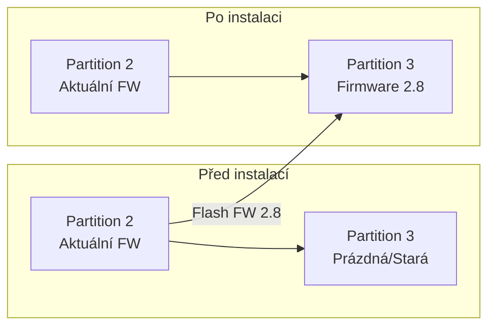
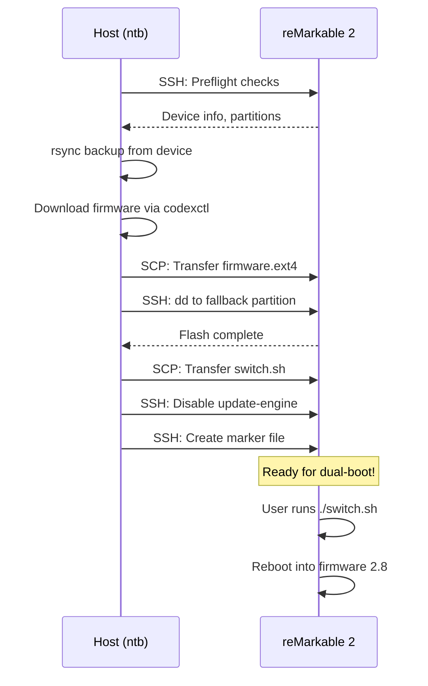

# reMarkable 2 Dual-Boot - Technical Documentation

Podrobná technická dokumentace vysvětlující jak Ansible role `remarkable-dualboot` nastavuje dual-boot na reMarkable 2 tabletu.

## Architektura reMarkable 2 Storage

reMarkable 2 používá eMMC storage s následující partition schématem:

```
/dev/mmcblk1
├── mmcblk1p1  - Boot partition (U-Boot, kernel)
├── mmcblk1p2  - Root filesystem A (active nebo fallback)
├── mmcblk1p3  - Root filesystem B (active nebo fallback)
└── mmcblk1p4  - Data partition (/home - notebooks, settings)
```

### A/B Partition Schema

reMarkable používá **A/B update schema** pro bezpečné aktualizace:

- **Active partition**: Aktuálně bootovaný systém
- **Fallback partition**: Záložní systém (pro rollback nebo nový update)

Stav je uložen v U-Boot environment variables:
```bash
fw_printenv active_partition   # Vrací 2 nebo 3
fw_printenv fallback_partition # Vrací 3 nebo 2
```

## Jak Dual-Boot Funguje

### Princip



Role naflashuje starší firmware (2.8) do **fallback partition**, zatímco aktuální systém zůstane nedotčen v **active partition**.

### Přepínání verzí

Script `switch.sh` mění U-Boot proměnné:

```bash
# Původní stav
active_partition=2    # Aktuální firmware
fallback_partition=3  # Firmware 2.8

# Po spuštění switch.sh
active_partition=3    # Firmware 2.8
fallback_partition=2  # Aktuální firmware
```

Po restartu tablet bootne z nové active partition.

---

## Detailní Průběh Ansible Role

### 1. Preflight Checks (`preflight.yml`)

```yaml
# Ověření SSH konektivity
raw: echo "SSH_OK"

# Zjištění aktuální verze
raw: cat /etc/version
# Výstup: "3.11.2.5" (příklad)

# Ověření modelu zařízení
raw: cat /sys/devices/soc0/machine
# Výstup: "reMarkable 2.0"

# Kontrola existujícího dual-bootu
raw: test -f /home/root/.dualboot_installed

# Zjištění partition layoutu
raw: fw_printenv active_partition
raw: fw_printenv fallback_partition
```

**Proč**: Zajistí, že pracujeme se správným zařízením a že operace není duplicitní.

---

### 2. Backup (`backup.yml`)

```yaml
# Na host (ntb) machine
command: rsync -avz \
  -e "ssh -p {{ remarkable_ssh_port }}" \
  root@10.11.99.1:/home/root/ \
  ./backups/remarkable/{{ timestamp }}/
```

**Co zálohuje**:
- `/home/root/.local/share/remarkable/` - Notebooks
- `/home/root/.config/` - Konfigurace
- Všechny uživatelské soubory

**Proč**: Data partition (`/home`) je sdílená mezi oběma OS verzemi, ale pro jistotu zálohujeme.

---

### 3. Download Firmware (`download_firmware.yml`)

```bash
# Na host machine
codexctl download --out ./firmware_cache/ --hardware rm2 2.8.0.307

# Struktura staženého souboru
2.8.0.307.swu  # Signed Update file
```

**Extrakce**:
```bash
codexctl extract 2.8.0.307.swu --out 2.8.0.307.ext4

# Výsledek: ext4 filesystem image (~256MB)
```

**Transfer na device**:
```bash
scp 2.8.0.307.ext4 root@10.11.99.1:/home/root/dualboot_tmp/
```

**Proč codexctl**: Oficiální nástroj pro práci s reMarkable firmware, umí stáhnout z reMarkable CDN.

---

### 4. Flash Firmware (`flash_firmware.yml`)

Toto je **kritická operace** - zápis do partition.

```yaml
# 1. Ověření cílové partition
fail:
  msg: "Invalid fallback partition"
  when: rm_fallback_partition not in ['2', '3']

# 2. Výpočet checksumu source
raw: md5sum /home/root/dualboot_tmp/2.8.0.307.ext4

# 3. Flash operace
raw: |
  sync  # Flush pending writes
  dd if=/home/root/dualboot_tmp/2.8.0.307.ext4 \
     of=/dev/mmcblk1p{{ rm_fallback_partition }} \
     bs=4M conv=fsync
  sync  # Ensure completion
```

**Parametry dd**:
| Parametr | Význam |
|----------|--------|
| `if=` | Input file (firmware image) |
| `of=` | Output file (target partition) |
| `bs=4M` | Block size 4MB (optimální pro eMMC) |
| `conv=fsync` | Sync po každém bloku |

**Proč fallback partition**: Nikdy nepřepisujeme aktivní partition, takže v případě problému zůstane aktuální systém bootovatelný.

---

### 5. Setup Dual-Boot (`setup_dualboot.yml`)

```yaml
# Transfer switch.sh
scp switch.sh root@10.11.99.1:/home/root/

# Nastavení execute permission
raw: chmod +x /home/root/switch.sh
```

**Obsah switch.sh**:
```bash
#!/bin/bash
# Nastavení U-Boot proměnných pro boot z druhé partition

fw_setenv "upgrade_available" "1"  # Signál pro U-Boot
fw_setenv "bootcount" "0"          # Reset boot counter

OLDPART=$(fw_printenv -n active_partition)
if [ "$OLDPART" == "2" ]; then
    NEWPART="3"
else
    NEWPART="2"
fi

fw_setenv "fallback_partition" "${OLDPART}"
fw_setenv "active_partition" "${NEWPART}"

reboot
```

**Jak U-Boot používá tyto proměnné**:

1. Při bootu U-Boot čte `active_partition`
2. Bootuje kernel z odpovídající partition
3. Kernel mountne rootfs z té samé partition
4. `/home` je vždy z partition 4 (shared)

---

### 6. Disable Updates (`disable_updates.yml`)

```yaml
raw: |
  systemctl stop update-engine
  systemctl disable update-engine
  systemctl mask update-engine
```

**Proč**:
- `update-engine` automaticky stahuje a instaluje nový firmware
- Nová verze by přepsala náš dual-boot setup
- `mask` zabrání i manuálnímu spuštění

**Obnovení v budoucnu**:
```bash
systemctl unmask update-engine
systemctl enable update-engine
systemctl start update-engine
```

---

## Bezpečnostní Mechanismy

### Idempotence

Role kontroluje marker file před jakoukoliv operací:
```yaml
raw: test -f /home/root/.dualboot_installed && cat /home/root/.dualboot_installed
```

Pokud marker existuje, role přeskočí flash operaci.

### Dry-Run Mode

```bash
ansible-playbook setup_remarkable.yml --check
```

S `--check` Ansible pouze simuluje změny, nic se neflashuje.

### User Confirmation

Playbook vyžaduje explicitní potvrzení:
```yaml
vars_prompt:
  - name: confirm_flash
    prompt: "Type 'yes' to proceed"
```

---

## Rollback Postup

### Pokud boot selže (černá obrazovka):

1. **Factory Reset via USB**:
   - Připoj tablet přes USB v recovery mode
   - Použij reMarkable Connection Utility (RCU) pro reflash

2. **Manuální partition switch** (pokud tablet bootne do shell):
   ```bash
   fw_setenv active_partition 2  # nebo 3
   reboot
   ```

### Pokud notebooks nejsou viditelné:

Data jsou v `/home` (partition 4), která je sdílená. Pokud firmware 2.8 nevidí novější notebook formát:
1. Přepni zpět na novější firmware
2. Export notebooks přes cloud

---

## Diagram Celého Procesu



---

## Reference

- [ddvk/remarkable-update](https://github.com/ddvk/remarkable-update) - switch.sh source
- [Jayy001/codexctl](https://github.com/Jayy001/codexctl) - Firmware management
- [remarkable.guide](https://remarkable.guide/) - Community documentation
- [A/B System Updates](https://source.android.com/docs/core/ota/ab) - Similar concept used in Android
