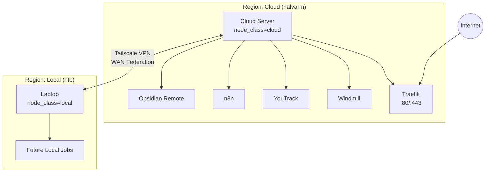

# Hybrid Infrastructure: Nomad Federation (Cloud + Local)

This project automates the deployment of a **federated** self-hosted stack across a **Cloud Server (`halvarm`)** and a **Local Machine (`ntb`)**.

## Architecture



**Key Points:**
- **Cloud (`halvarm`)**: Runs heavy workloads and serves as public ingress
- **Local (`ntb`)**: Part of the same cluster, useful for development or offloading tasks
- **Network**: Nodes connected via **Tailscale** mesh VPN

## Requirements

| Component | Version | Notes |
|-----------|---------|-------|
| Ansible | ≥2.14 | With `community.general` collection |
| Python | ≥3.10 | On control node |
| SSH | - | Passwordless access to `halvarm` |
| Tailscale | Latest | Installed & authenticated on both nodes |

## Ansible Roles

| Role | Description |
|------|-------------|
| `preflight` | Pre-deployment validation (Tailscale, disk space, connectivity) |
| `common` | Base packages, swap, firewall (UFW), public IP detection |
| `tailscale` | Tailscale installation and authentication check |
| `docker` | Docker CE installation with Compose plugin |
| `hashicorp` | Consul, Vault, Nomad installation and configuration |
| `nomad_jobs` | Deploys Nomad job files (Traefik, Windmill, YouTrack, n8n, Obsidian) |

## Services & Access

After deployment, services are available at these URLs (using `nip.io` DNS):

| Service | URL | Default Credentials |
|---------|-----|---------------------|
| **Windmill** | `http://windmill.<SERVER_IP>.nip.io` | `admin@windmill.dev` / `changeme` |
| **YouTrack** | `http://youtrack.<SERVER_IP>.nip.io` | Setup wizard on first run |
| **n8n** | `http://n8n.<SERVER_IP>.nip.io` | Create owner on first run |
| **Obsidian** | `http://obsidian.<SERVER_IP>.nip.io` | Direct vault access |
| **Traefik** | `http://<SERVER_IP>:8080` | Dashboard (insecure) |

## Ports Reference

| Port | Service | Protocol | Notes |
|------|---------|----------|-------|
| 22 | SSH | TCP | Remote access |
| 80 | Traefik | TCP | HTTP ingress |
| 443 | Traefik | TCP | HTTPS ingress |
| 4646 | Nomad | TCP | API/UI |
| 4647 | Nomad | TCP | RPC |
| 4648 | Nomad | TCP/UDP | Serf (gossip) |
| 8200 | Vault | TCP | API/UI |
| 8300-8302 | Consul | TCP/UDP | Server RPC, Serf |
| 8500 | Consul | TCP | API/UI |
| 8080 | Traefik | TCP | Dashboard |

## Deployment

### Quick Start

```bash
cd infrastruct/nomad_stack
ansible-playbook -i inventory.yml playbook.yml -K
```

The `-K` flag prompts for your local sudo password.

### What This Does

1. **Pre-flight Checks**: Validates Tailscale auth, disk space, connectivity
2. **Configures `halvarm`**: Installs stack, sets firewall rules, creates swap
3. **Configures `localhost`**: Installs stack (skips firewall/swap for safety)
4. **Federates**: Connects both nodes into single cluster via Tailscale
5. **Deploys Jobs**: Submits Nomad jobs with node constraints

### Deploy to Server Only

```bash
ansible-playbook -i inventory.yml playbook.yml -l servers
```

### Skip Pre-flight Checks

```bash
ansible-playbook -i inventory.yml playbook.yml --skip-tags preflight
```

## HTTPS/TLS Setup (Let's Encrypt)

To enable HTTPS with automatic certificates:

1. **Edit** `roles/nomad_jobs/templates/traefik.nomad.hcl.j2`
2. **Uncomment** the ACME configuration:

```hcl
args = [
  # ... existing args ...
  
  # 1. HTTP to HTTPS Redirection
  "--entrypoints.web.http.redirections.entryPoint.to=websecure",
  "--entrypoints.web.http.redirections.entryPoint.scheme=https",
  
  # 2. Certificate Resolver (LetsEncrypt)
  "--certificatesresolvers.myresolver.acme.email=your-email@example.com",
  "--certificatesresolvers.myresolver.acme.storage=/letsencrypt/acme.json",
  "--certificatesresolvers.myresolver.acme.httpchallenge=true",
  "--certificatesresolvers.myresolver.acme.httpchallenge.entrypoint=web",
]
```

3. **Update service tags** in job files to use the resolver:

```hcl
tags = [
  "traefik.enable=true",
  "traefik.http.routers.myapp.rule=Host(`myapp.example.com`)",
  "traefik.http.routers.myapp.entrypoints=websecure",
  "traefik.http.routers.myapp.tls.certresolver=myresolver",
]
```

4. **Re-run Ansible** to apply changes.

## Backup & Restore

### Vault Keys (Critical!)

The first run generates `vault_keys.json` in `infrastruct/nomad_stack/`.

> [!CAUTION]
> Move this file to a secure password manager immediately! It contains your Unseal Keys and Root Token.

### YouTrack Backup

```bash
# On server - data is in /opt/youtrack/backups/
ssh halvarm "ls -la /opt/youtrack/backups/"

# Download backup
scp halvarm:/opt/youtrack/backups/<backup_file> ./
```

### Full Data Directories

| Service | Data Path |
|---------|-----------|
| YouTrack | `/opt/youtrack/{data,conf,logs,backups}` |
| Windmill | `/opt/windmill/{db,worker_cache,lsp_cache}` |
| n8n | `/opt/n8n/data` |
| Obsidian | `/opt/obsidian/{config,vaults}` |
| Traefik | `/opt/traefik/acme` |

## Troubleshooting

### Pre-flight Check Failed

If preflight fails, check the specific error message. Common issues:

| Error | Solution |
|-------|----------|
| "Tailscale not authenticated" | Run `sudo tailscale up` on the failing host |
| "Cannot reach WAN peer" | Check Tailscale status on both nodes |
| "Low disk space" | Free up space or expand disk |

### Stuck Deployment / Split Brain

If nodes can't see each other after IP changes:

```bash
# On server
ssh halvarm "sudo systemctl stop consul vault nomad && sudo rm -rf /opt/consul/* /opt/vault/* /opt/nomad/*"

# On localhost
sudo systemctl stop consul vault nomad
sudo rm -rf /opt/consul/* /opt/vault/* /opt/nomad/*

# Re-run Ansible
ansible-playbook -i inventory.yml playbook.yml -K
```

### Check Cluster Health

```bash
# Nomad federation
nomad server members

# Consul WAN
consul members -wan

# Vault status
vault status
```

### View Job Logs

```bash
# Find allocation ID
nomad job status windmill

# View logs
nomad alloc logs <alloc_id> windmill-server
```

## Adding New Services

1. Create job template in `roles/nomad_jobs/templates/myservice.nomad.hcl.j2`
2. Add node constraint:
   ```hcl
   constraint {
     attribute = "${node.class}"
     value     = "cloud"  # or "local"
   }
   ```
3. Add template to `roles/nomad_jobs/tasks/main.yml`
4. Run Ansible again