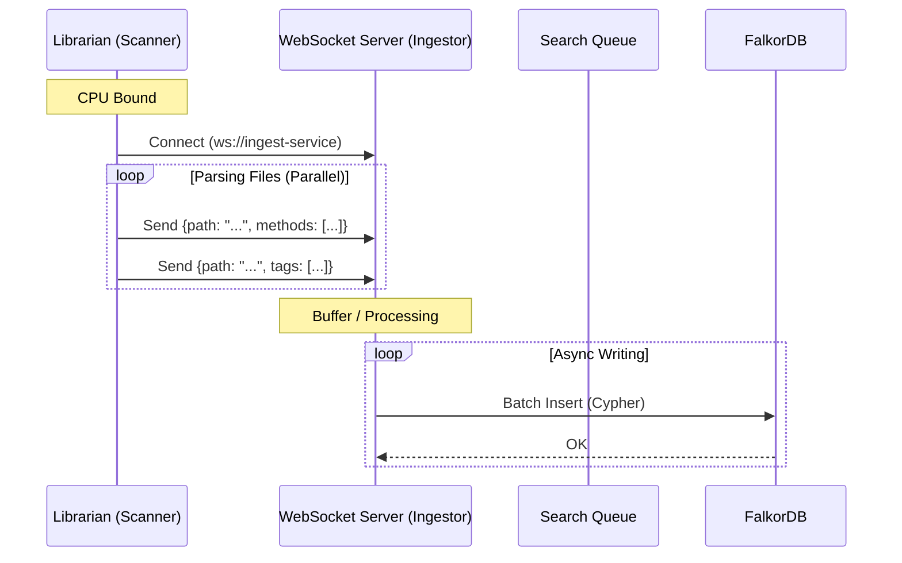

# Architecture: WebSocket decoupling for High-Throughput Ingestion

## Concept
Instead of the Librarian daemon (Go or Julia) writing directly to the database (blocking on network IO), it pushes parsed metadata to a high-speed **WebSocket endpoint**. An external worker (e.g., in Windmill) consumes this stream and handles the database transactions asynchronously.

## Benefits

1.  **Zero-Blocking Ingestion**: The parser can fire-and-forget JSON payloads over a persistent WebSocket connection. WebSockets are extremely lightweight compared to creating new HTTP/DB connections.
2.  **Backpressure Handling**: The WebSocket server can buffer incoming messages if the DB is slow, preventing the parser from stalling.
3.  **Horizontal Scalability**: You could run multiple DB writer workers consuming from the WebSocket queue (or an intermediate message broker like NATS/Redis PubSub) without changing the parser code.
4.  **Simplified Parser**: The parser becomes a "dumb" scanner that just says "Here is a file's metadata" without knowing *how* or *where* it is stored.

## Proposed Data Flow

## Implementation Strategy

### 1. Librarian Client (Scanner)
*   **Change**: Replace `db.UpsertX` calls with `ws.WriteJSON(metadata)`.
*   **Performance**: WebSockets support piping massive throughput. Parsing speed becomes the only limit.

### 2. Ingestion Service (Windmill/Node/Go)
*   A standalone service (or Windmill script running as a long-lived worker) listens for WebSocket connections.
*   **Batching Logic**:
    *   buffer incoming messages.
    *   Every 100ms or 1000 items (whichever comes first), flush to FalkorDB using pipeline/batching.
*   **Windmill Integration**: Windmill typically runs *scripts* (short-lived). For a WebSocket server, you'd likely deploy a dedicated container (e.g., a small Go/Node app) managed by Nomad, or use Windmill's **Flows** with webhooks if HTTP overhead is acceptable (but WebSockets are faster).

## Comparison vs. Current

| Feature | Current (Direct DB) | WebSocket Decoupling |
| :--- | :--- | :--- |
| **Parsing Speed** | Throttled by DB Latency | **Unbound (CPU Limit)** |
| **Complexity** | Low (All-in-one) | **Medium (Requires Ingest Service)** |
| **Reliability** | Atomic (Wait for confirm) | **Eventual Consistency** (Fire & Forget) |
| **Network** | Many DB Roundtrips | **Single Persistent Connection** |

## Recommendation
For a vault of ~10k-50k files, this is **highly effective**. It allows the local scanner to finish in seconds (as seen in the Julia benchmark) while the database catches up in the background. It fits perfectly with the "Librarian" concept—the scanner drops books in the return bin, and the librarian (worker) shelves them later.
