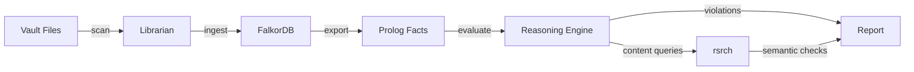

# Vault Validation & Reasoning System Specification

> **Status**: Proposal  
> **Priority**: Medium  
> **Date**: 2025-12-26

## 1. Overview

A system for automatically validating, reasoning about, and enforcing structural and semantic rules across the Obsidian vault using ontologies, logic programming (Prolog/ELPI), and LLM-based content analysis.

## 2. Problem Statement

- No automated way to enforce documentation standards (e.g., "every project must have a README").
- Manual verification of vault structure is error-prone and time-consuming.
- Structural rules are implicit and undocumented, leading to inconsistency.
- Content quality (completeness, relevance) cannot be validated without human review.
- "What-if" reasoning (e.g., "if I add this link, does it break consistency?") is not possible.

## 3. Goals

1. **Declarative Rule Definition**: Define vault structure rules in a formal, machine-readable format.
2. **Automated Validation**: Run validators that report violations and suggestions.
3. **Semantic Reasoning**: Support "what-if" queries and inference over the vault graph.
4. **LLM Integration**: Use rsrch for content-level analysis where structural rules are insufficient.
5. **Extensibility**: Easy to add new rules without modifying core logic.

## 4. Technical Design

### 4.1 Architecture Layers

```
┌─────────────────────────────────────────────────────────────┐
│  Layer 4: LLM Analysis (rsrch)                              │
│  "Is this documentation complete?" / "Summarize this note"  │
├─────────────────────────────────────────────────────────────┤
│  Layer 3: Reasoning Engine (SWI-Prolog / ELPI)              │
│  Rule evaluation, inference, anomaly detection              │
├─────────────────────────────────────────────────────────────┤
│  Layer 2: Ontology / Schema                                 │
│  Classes: Project, Agent, Role, Documentation               │
│  Properties: hasReadme, belongsTo, linksTo                  │
├─────────────────────────────────────────────────────────────┤
│  Layer 1: Data Extraction (Librarian → FalkorDB)            │
│  Vault scanning, structure, links, metadata                 │
└─────────────────────────────────────────────────────────────┘
```

### 4.2 Technology Selection: SWI-Prolog vs. ELPI

| Feature | SWI-Prolog | ELPI (λProlog) |
|---------|------------|----------------|
| Higher-Order Unification | ❌ | ✅ |
| Hypothetical Reasoning | Limited (`assert/retract`) | ✅ Native (`=>`) |
| HOAS (Binding in AST) | ❌ | ✅ |
| Ecosystem (HTTP, JSON, DB) | ✅ Excellent | ❌ Limited |
| Debugging/Tooling | ✅ | ❌ |
| Embedding | C FFI | OCaml FFI |

#### Decision Framework

Use **SWI-Prolog** if:
- Flat database-style queries (`project(X), has_readme(X).`)
- Integration with external systems (HTTP APIs, FalkorDB)
- Constraint Logic Programming (numerical constraints)
- Rapid prototyping with REPL

Use **ELPI** if:
- Data contains lambdas/binders (e.g., template matching, code ASTs)
- Local hypothetical reasoning without side-effects
- Meta-programming over rules themselves
- Tight OCaml integration needed

> **Initial Recommendation**: Start with SWI-Prolog for prototyping; consider ELPI if hypothetical reasoning becomes critical.

### 4.3 Rule Examples

```prolog
% Every project in agents/ must have a README
violation(missing_readme, Project) :-
    project(Project),
    \+ has_file(Project, 'README.md').

% Every agent must reference LESSONS_LEARNED.md
violation(missing_lessons_link, Agent) :-
    agent(Agent),
    \+ links_to(Agent, 'LESSONS_LEARNED.md').

% Hypothetical: Would adding a README fix violations?
would_fix(Project) :-
    violation(missing_readme, Project),
    (has_file(Project, 'README.md') => \+ violation(_, Project)).
```

### 4.4 LLM Integration Points

| Check Type | Trigger | LLM Query |
|------------|---------|-----------|
| Documentation completeness | `has_readme(X)` but content < 100 chars | "Is this README complete?" |
| Semantic deduplication | Multiple notes with similar embeddings | "Are these notes duplicates?" |
| Content summarization | On-demand or batch | "Summarize this folder's purpose" |

### 4.5 Data Flow



## 5. Implementation Phases

### Phase 1: Foundation (Week 1-2)
- [ ] Create FalkorDB → Prolog export script
- [ ] Define initial ontology (Project, Agent, Documentation classes)
- [ ] Implement 5 basic structural rules
- [ ] CLI command: `librarian validate`

### Phase 2: Inference (Week 3-4)
- [ ] Add hypothetical reasoning support
- [ ] Implement "what-if" queries
- [ ] Add rule composition (complex rules from simple ones)

### Phase 3: LLM Integration (Week 5-6)
- [ ] Connect rsrch for content validation
- [ ] Implement semantic deduplication check
- [ ] Add natural language rule explanations

### Phase 4: Automation (Week 7-8)
- [ ] Windmill workflow for scheduled validation
- [ ] GitHub Action for PR checks
- [ ] Notification on new violations

## 6. Configuration

| Variable | Description | Default |
|----------|-------------|---------|
| `VAULT_RULES_PATH` | Path to Prolog rules file | `./rules/vault.pl` |
| `FALKORDB_EXPORT_FORMAT` | Export format | `prolog` |
| `RSRCH_ENDPOINT` | rsrch API for content checks | `http://localhost:3000` |
| `VALIDATION_MODE` | `strict` / `warn` | `warn` |

## 7. Success Criteria

- [ ] Detect 100% of structural violations defined in rules
- [ ] < 5s validation time for vault with 1000 notes
- [ ] Zero false positives on well-formed projects
- [ ] LLM checks return actionable feedback

## 8. Related Documentation

- [Librarian README](../implementations/go/librarian/README.md)
- [FalkorDB Schema](../implementations/go/librarian/SCHEMA.md)
- [[Prods/01-pwf/LESSONS_LEARNED|LESSONS_LEARNED.md]]

---

> 📋 **Work Breakdown**: To be added to project WBS after approval.
